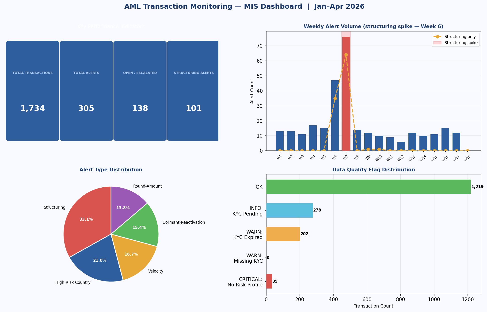
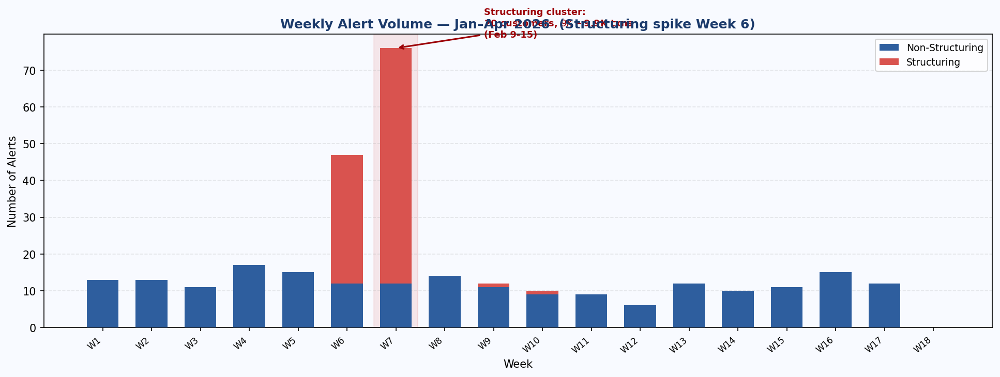
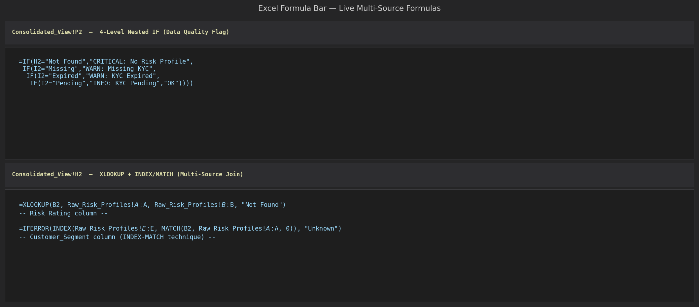
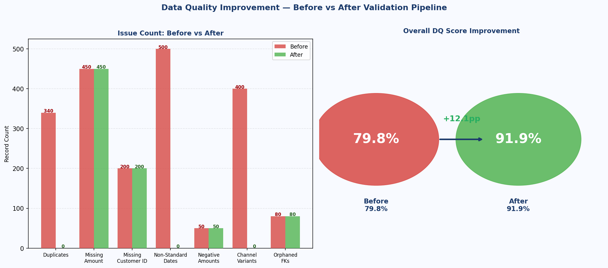
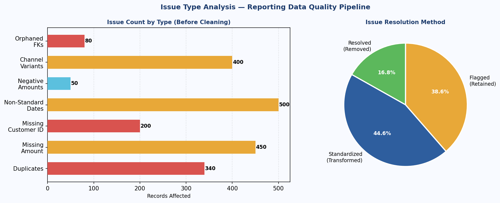

# Excel & MIS Analytics Portfolio

**Uday Vimal** · udayvimal08@gmail.com · [github.com/udayvimal](https://github.com/udayvimal)

---

> I build MIS dashboards and data pipelines that operations and compliance teams can actually use — multi-sheet Excel workbooks driven entirely by live formulas (XLOOKUP, nested IF, SUMIFS, COUNTIFS), Python data quality pipelines with before/after audit trails, and structured reporting frameworks designed to surface anomalies before they become incidents.
>
> This page is a curated showcase. Every project links to its full source repo.

---

## What This Portfolio Covers

| Skill Area | Projects |
|---|---|
| Advanced Excel formula work | Advanced Excel Reporting Framework, Content Moderation MIS |
| MIS dashboard design | AML Transaction Monitoring, Content Moderation, Excel Framework |
| Data quality validation | Reporting Data Quality Pipeline |
| AML / compliance reporting | AML Transaction Monitoring MIS |
| Operations analytics | Content Moderation MIS, Excel Reporting Framework |

**Formula depth:** XLOOKUP, INDEX/MATCH, nested IF (4-level), SUMIFS, COUNTIFS, AVERAGEIFS, SUMPRODUCT, WEEKNUM, TEXT, DATEVALUE, IFERROR — all used live in workbooks, not hardcoded summaries.

---

## Projects

### 1. Advanced Excel Reporting Framework

**[View Full Project →](https://github.com/udayvimal/advanced-excel-reporting-framework)**

#### Business Problem

A 180-day support operations dataset (4,961 tickets, 15 agents, 7 categories) had no structured visibility into which agents and categories were driving SLA breaches. Management needed a single workbook that could answer "which agent is in trouble?" in one dropdown selection, and "where did we breach last week?" in one glance — without anyone manually updating pivot tables.

The workbook delivers that: an XLOOKUP-powered agent spotlight that repopulates on dropdown change, a weekly SLA trend that highlights the March 9–15 incident surge, and category-level COUNTIFS/AVERAGEIFS that pinpoint Technical tickets (28+ hour avg resolution) as the core problem.


*Dashboard sheet: 6 live KPI boxes, XLOOKUP agent spotlight with data-validation dropdown, 30-day trend table with conditional formatting, 2 embedded charts. Nothing hardcoded.*

#### Formula & Techniques Reference

| Formula / Technique | Sheet | Purpose |
|---|---|---|
| `XLOOKUP` | Dashboard | Agent spotlight — pulls ticket count, resolution time, SLA%, health status for any selected agent |
| `INDEX / MATCH` | Agent_Summary | Cross-table lookup for Department and Tier from reference table |
| `SUMIFS` | Dashboard, Category_Breakdown | Multi-condition aggregation: category + priority + date range |
| `COUNTIFS` (multi-criteria) | All sheets | Tickets filtered by agent, category, priority, SLA outcome simultaneously |
| `AVERAGEIFS` | Category_Breakdown | Avg resolution time per category-priority combination (28 rows) |
| 4-level nested `IF` | Agent_Summary | Derives `Health_Status`: Critical / Warning / Healthy from SLA% AND resolution time |
| Conditional Formatting | Raw_Data, Agent_Summary, Dashboard | Traffic-light: red/yellow/green on SLA compliance and Health Status |
| Data Validation Dropdown | Dashboard | Agent selector (B9) + Category filter (B11) — feed XLOOKUP formulas |
| `IFERROR` | All computed columns | Division-by-zero protection throughout |


*Formula bar evidence: `=XLOOKUP(B9, Agent_Summary!$A$2:$A$16, Agent_Summary!$B$2:$B$16, "Not Found")` in Dashboard D9. Selecting any agent from the dropdown dynamically updates all four spotlight metrics.*


*Weekly ticket volume + SLA trend. The March 9–15 incident week (red highlight) shows volume spiking 60%+ above baseline while SLA compliance drops from 76% to 55.2% — the kind of operational signal this framework is built to surface.*

#### Key Results

- **Overall SLA Compliance: 75.1%** against a 95% target — root cause identified: Technical category averaging 28+ hours resolution
- **Technical category SLA: 54.5%** — worst-performing by 20+ percentage points vs. overall average
- **Incident week (Mar 9–15) SLA: 55.2%** — 21-point drop from baseline, surfaced by the weekly trend table

**Workbook:** 4 sheets — `Raw_Data` (4,961 rows), `Agent_Summary` (COUNTIF/AVERAGEIF per agent), `Category_Breakdown` (28-row SUMIFS grid), `Dashboard` (live KPIs + XLOOKUP spotlight + charts). Requires Excel 365 or 2019+ for XLOOKUP.

---

### 2. Content Moderation Operations MIS Dashboard

**[View Full Project →](https://github.com/udayvimal/content-moderation-mis-dashboard)**

#### Business Problem

A trust & safety team processing 14,400+ daily moderation decisions across 20 moderators and 8 content categories had no structured view of which moderator was at risk of burnout or error accumulation, or which category was driving SLA breaches. The dashboard was built to answer those questions without BI tooling — pure Excel formula-driven workbook with a management-ready dashboard sheet.

The critical operational finding: SLA compliance drops from ~96% on normal weekdays to ~80% during the five-day February incident window, with Monday volumes running 40% above baseline due to weekend queue accumulation. The dashboard makes this pattern impossible to miss.

#### Formula & Techniques Reference

| Formula / Technique | Sheet | Purpose |
|---|---|---|
| `SUMIF` / `AVERAGEIF` | Moderator_Summary, MIS_Report | Total reviewed, avg review time, error counts per moderator/day |
| `SUMIFS` / `SUMPRODUCT` | Dashboard weekly rollups | Multi-condition weekly aggregation by date range |
| `XLOOKUP` | Dashboard trend table | Cross-sheet daily metric lookup from MIS_Report |
| 4-level nested `IF` | Moderator_Summary, Dashboard | `Performance_Tier`: Top Performer / Standard / Needs Review / At Risk |
| `WEEKNUM` + `TEXT` + `DATEVALUE` | MIS_Report | Week-number column + human-readable day-of-week label |
| `IFERROR` | All ratio columns | Zero-division protection on SLA% and error rate calculations |
| Conditional Formatting | All sheets | Traffic-light SLA colours (red <90%, yellow 90–94.99%, green ≥95%) |
| Data Validation Dropdown | Dashboard | Category filter (H9) — 8-item list: All Categories through Self-Harm |
| Embedded Charts (Bar + Line) | Dashboard | Weekly volume bar + SLA compliance line, y-axis floored at 80% |

#### Key Results

- **90-day total: 14,400+ moderation decisions** across 20 moderators, 8 categories
- **Monday SLA compliance: ~88%** — 8 points below the 96% weekday baseline, driven by weekend queue accumulation
- **February incident window SLA: ~80%** — five-times the normal breach rate; identified as requiring staggered Sunday–Monday shift overlap to clear

**Workbook:** 5 sheets — `Raw_Data` (14,400 rows with CF on Status), `Moderator_Summary` (SUMIF/AVERAGEIF + 4-tier nested IF per moderator), `Category_Breakdown` (8-category SUMIF/AVERAGEIF grid), `MIS_Report` (90-row daily pivot equivalent), `Dashboard` (KPI banner + XLOOKUP trend table + 2 charts). Requires Excel 365 or 2019+ for XLOOKUP.

---

### 3. AML Transaction Monitoring MIS Report

**[View Full Project →](https://github.com/udayvimal/aml-transaction-monitoring-mis)**

#### Business Problem

An AML compliance team monitoring 1,734 transactions across 120 days needed a single Excel workbook that joined three separate source tables (transaction log, customer risk profiles, alert log), surfaced data quality issues like orphaned foreign keys and expired KYC, and produced weekly/monthly MIS trend reports — the type of ad-hoc compliance reporting workflow that would typically require a BI tool or SQL query, built instead in pure Excel formulas.

The most significant analytical finding: 20 customers each made 4–6 cash or wire transactions of $9,000–$9,999 within the same 7-day window in Week 6, a textbook structuring pattern designed to evade the $10,000 CTR threshold. All 20 were already flagged as High Risk in the customer master — a cross-source insight surfaced only because the XLOOKUP join connected the transaction log to the risk profiles.


*Dashboard sheet: KPI cards (total transactions, total alerts, open/escalated/structuring counts), weekly alert trend with structuring spike visible in Week 6, alert type breakdown, and DQ flag distribution.*

#### Formula & Techniques Reference

| Formula / Technique | Sheet | Purpose |
|---|---|---|
| `XLOOKUP` (cross-sheet) | Consolidated_View | Joins transactions → risk profiles (Risk_Rating); transactions → alerts (Alert_ID) |
| `INDEX / MATCH` | Consolidated_View | Alternative cross-sheet join for Customer_Segment |
| 4-level nested `IF` | Consolidated_View col P | DQ flag: `CRITICAL: No Risk Profile` / `WARN: Missing KYC` / `WARN: KYC Expired` / `INFO: KYC Pending` / `OK` |
| `COUNTIFS` (multi-criteria) | Weekly MIS, Monthly MIS | Alert counts by date range + alert type + status simultaneously |
| `SUMIFS` / `AVERAGEIFS` | Weekly MIS | Sum/avg resolution days filtered by date range and status |
| `IFERROR` | Consolidated_View | Null-handling when transaction has no matching alert |
| Conditional Formatting | All sheets | Traffic-light CF on risk rating, DQ flags, SLA breach column |
| Data Validation Dropdown | Ad_Hoc_Scorecard | Alert type filter driving dynamic COUNTIFS output |
| MoM % change formula | Monthly MIS | `=(E3-E2)/E2` — month-over-month alert volume trend |


*Stacked weekly bar: non-structuring (blue) vs structuring (red). Week 6 (Feb 9–15) anomaly is immediately visible — 20 customers, 4–6 transactions each, $9,000–$9,999 range, all High Risk. Recommended action: file SARs and escalate.*


*Consolidated_View formula bar: `=XLOOKUP(B2, Raw_Risk_Profiles!$A:$A, Raw_Risk_Profiles!$B:$B, "Not Found")` — cross-sheet join from transaction log to customer risk profiles. "Not Found" return triggers the CRITICAL DQ flag in column P.*

#### Key Results

- **305 alerts across 1,734 transactions — 17.6% alert rate** over 120 monitoring days
- **Week 6 structuring cluster: 20 High-Risk customers**, each with 4–6 sub-threshold transactions — textbook SAR trigger
- **10 orphaned alert records detected** (Alert_IDs referencing Transaction_IDs absent from the transaction table) — surfaced by the XLOOKUP DQ check returning "Not Found"

**Workbook:** 8 sheets — `Raw_Transactions`, `Raw_Risk_Profiles`, `Raw_Alerts` (3 source tables), `Consolidated_View` (XLOOKUP/INDEX-MATCH join + 4-level DQ flag), `Weekly_MIS_Report`, `Monthly_MIS_Report`, `Ad_Hoc_Scorecard` (dynamic COUNTIFS with dropdown), `Dashboard`.

---

### 4. Reporting Data Quality & Validation Pipeline

**[View Full Project →](https://github.com/udayvimal/reporting-data-quality-validation-pipeline)**

#### Business Problem

MIS reports are only as reliable as the source data feeding them. This project demonstrates the full data quality lifecycle: a 10,000-row source dataset is deliberately seeded with seven classes of real-world issues (duplicates, non-standard date formats, missing values, channel label variants, orphaned foreign keys, negative amounts), then passed through a rule-based Python validation pipeline that profiles the data before and after, and delivers the findings as a conditional-formatted Excel scorecard with a full audit log.

The project makes explicit the three-tier resolution framework used in production MIS pipelines: **Remove** exact duplicates (zero informational value), **Transform** formatting inconsistencies (deterministic to fix), **Flag** ambiguous issues for human review (a negative amount may be a valid refund; silently dropping it destroys the audit trail).


*Before/after scorecard: grouped bars (red = before, green = after) per issue type, plus DQ score circles — 79.8% → 91.9%, +12.1 percentage points. Three issue types fully resolved; four retained with flag columns for human review.*

#### Pipeline & Techniques Reference

| Technique | Description |
|---|---|
| Seeded issue generation | 7 distinct defect classes injected at known positions, then shuffled randomly into a 10,000-row dataset |
| Rule-based validation (7 rules) | VR-01 deduplication, VR-02 date standardization, VR-03 channel label normalization, VR-04–07 flag columns |
| Before/after profiling | Full profile computed pre- and post-pipeline; delta metrics quantify improvement |
| Audit log | One record per validation rule: rule name, before count, after count, records affected, action taken |
| Excel conditional formatting | Before Count > 0 → red; After Count = 0 → green (resolved); After Count > 0 → yellow (flagged) |
| Remove / Transform / Flag framework | Deterministic triage: drop duplicates, normalize formats, retain ambiguous issues with flag columns |


*Left: horizontal bar by issue type (volume before cleaning). Right: pie by resolution method — Resolved/Removed (duplicates eliminated), Standardized/Transformed (dates + channel labels), Flagged/Retained (missing values, negatives, orphaned FKs requiring human review).*

**Pipeline excerpt — three core validation rules:**

```python
# VR-01: Deduplication
clean_df = messy_df.drop_duplicates(
    subset=["Transaction_ID","Customer_ID","Date","Amount","Channel"], keep="first"
)

# VR-02: Multi-format date standardization
def standardize_date(v):
    for fmt in ["%Y-%m-%d", "%d/%m/%Y", "%m-%d-%Y", "%d-%b-%Y", "%B %d, %Y"]:
        try: return datetime.strptime(str(v), fmt).strftime("%Y-%m-%d")
        except: pass

# VR-07: Orphaned foreign key detection
clean_df["Orphaned_FK_Flag"] = (
    ~clean_df["Customer_ID"].isin(CUST_MASTER) & clean_df["Customer_ID"].notna()
).astype(int)
```

#### Key Results

- **DQ Score: 79.8% → 91.9% (+12.1 pp)** after pipeline execution on a 10,000-row source dataset
- **340 duplicate records eliminated** (3.4% of source); **500 non-standard dates normalized** to ISO 8601; **400 channel label variants** mapped to 6 canonical values
- **80 orphaned FK records flagged** for source-system reconciliation — the kind of referential integrity gap that corrupts downstream MIS joins silently

**Workbook:** 3 sheets — `DQ_Summary` (before/after scorecard with CF), `Audit_Log` (7-row rule execution log), `Validation_Rules` (full rule definitions with field, logic, action, priority).

---

## Skills Reference

### Excel Formulas Used Across These Projects

| Formula | Projects Using It | Purpose |
|---|---|---|
| `XLOOKUP` | Excel Framework, Content Moderation, AML | Cross-sheet lookups; agent/category/transaction spotlights |
| `INDEX / MATCH` | Excel Framework, AML | Alternative lookup; multi-column reference returns |
| `SUMIFS` | All four | Multi-condition sum (date range + category + status) |
| `COUNTIFS` | All four | Multi-condition counts (the workhorse of MIS reporting) |
| `AVERAGEIFS` | Excel Framework, Content Moderation | Conditional averages for resolution time and review time |
| Nested `IF` (4-level) | All four | Performance tiers, health status, DQ flags |
| `IFERROR` | All four | Zero-division and null-handling throughout |
| `SUMPRODUCT` | Content Moderation | Weekly multi-condition rollups where SUMIFS can't span arrays |
| `WEEKNUM`, `TEXT`, `DATEVALUE` | Content Moderation, AML | Week labeling and day-of-week display in MIS reports |
| Conditional Formatting | All four | Traffic-light rules: SLA compliance, health status, DQ flags |
| Data Validation Dropdowns | Excel Framework, Content Moderation, AML | Agent/category/alert-type selectors driving dynamic output |
| Embedded Charts | Excel Framework, Content Moderation, AML | Line + bar charts referenced from formula-driven helper tables |

### MIS Reporting Patterns

- **Pivot-table equivalent via COUNTIFS/SUMIFS**: all summary sheets avoid pivot tables to keep formulas live and auditable
- **Multi-source join in Excel**: XLOOKUP + INDEX/MATCH connecting 3 source tables (AML project)
- **Week-over-week and month-over-month trend tracking** with COUNTIFS date range criteria
- **Traffic-light conditional formatting** applied via formula rules (not hardcoded), so CF recalculates when data changes
- **DQ flag columns** appended to source data rather than silent drops — preserving audit trails

---

## About

I'm an analytics student with a focus on the MIS and operations-reporting layer of data work — the part that actually reaches the decision-maker's desk. These projects were built to demonstrate that I can construct the reporting infrastructure an operations or compliance team needs from scratch: designing the data model, writing the formulas, building the dashboard, and making the anomalies obvious.

I also work with Python (pandas, openpyxl, matplotlib, sklearn, LangGraph) — the projects above use Python to generate data and build Excel workbooks programmatically, which means every formula and formatting rule is reproducible. See my other repos for ML and pipeline work.

**Contact:** udayvimal08@gmail.com | [GitHub](https://github.com/udayvimal)
