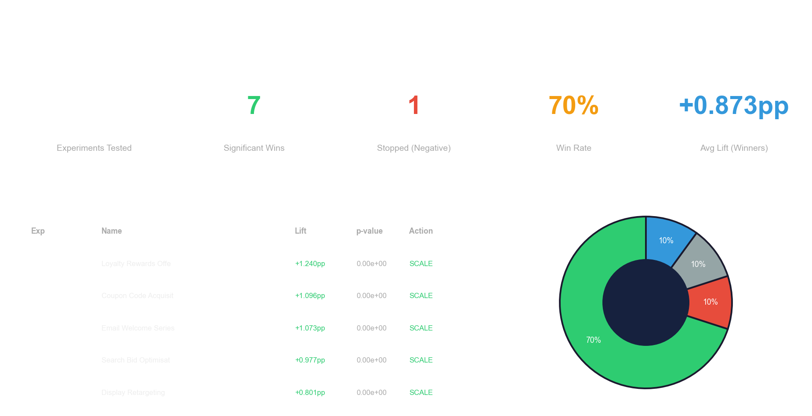
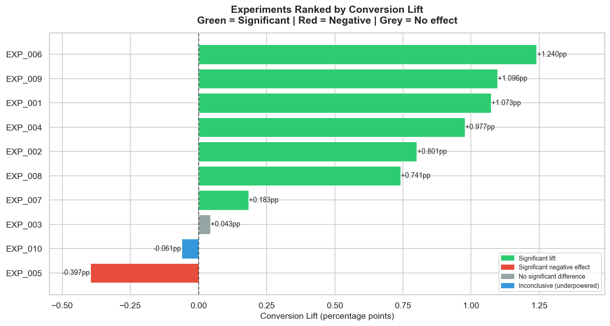
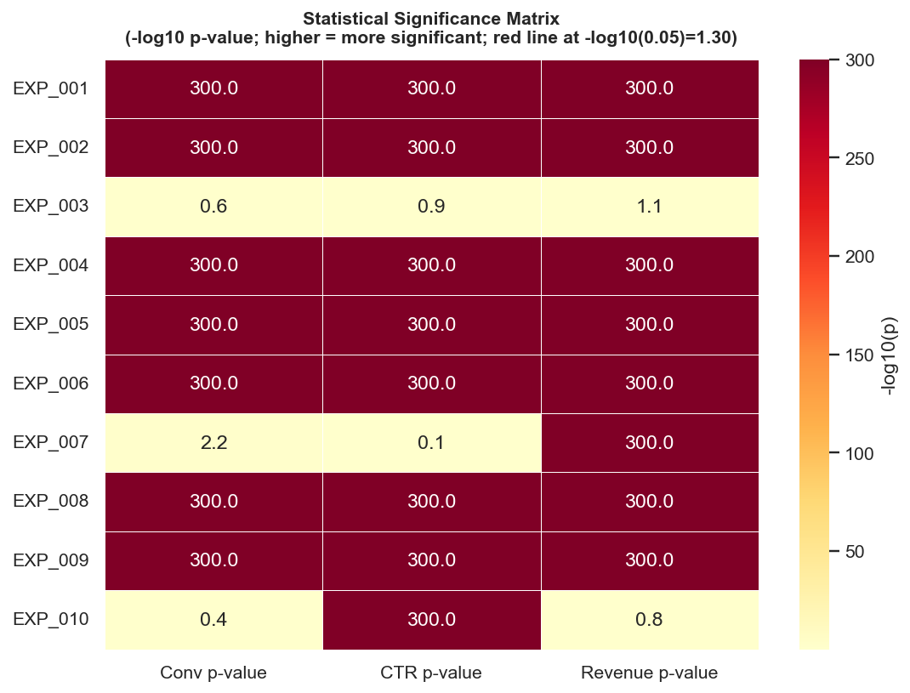
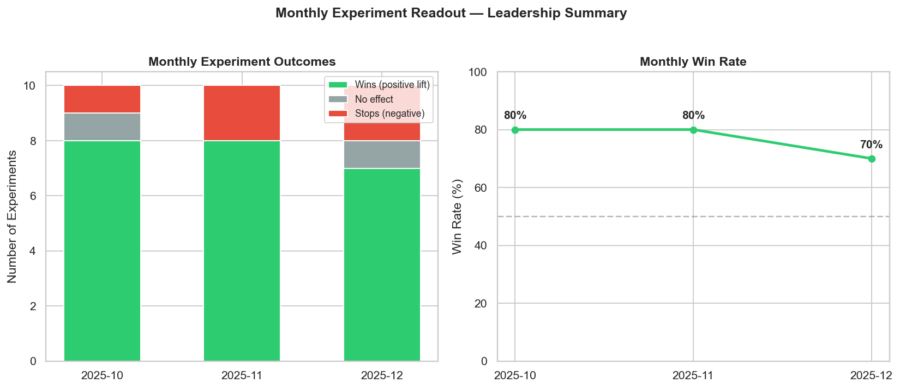
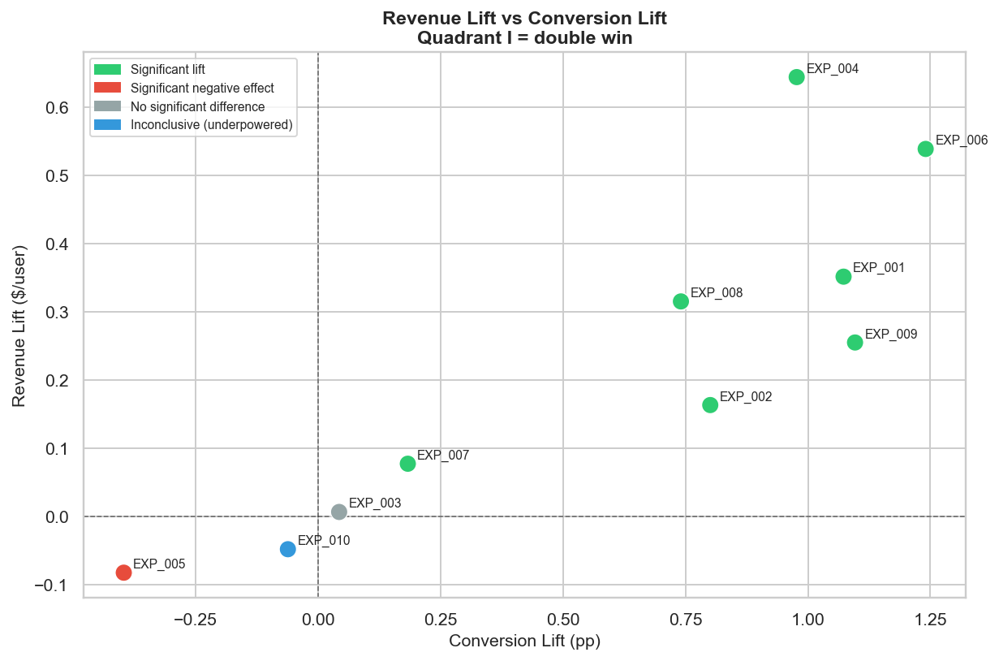
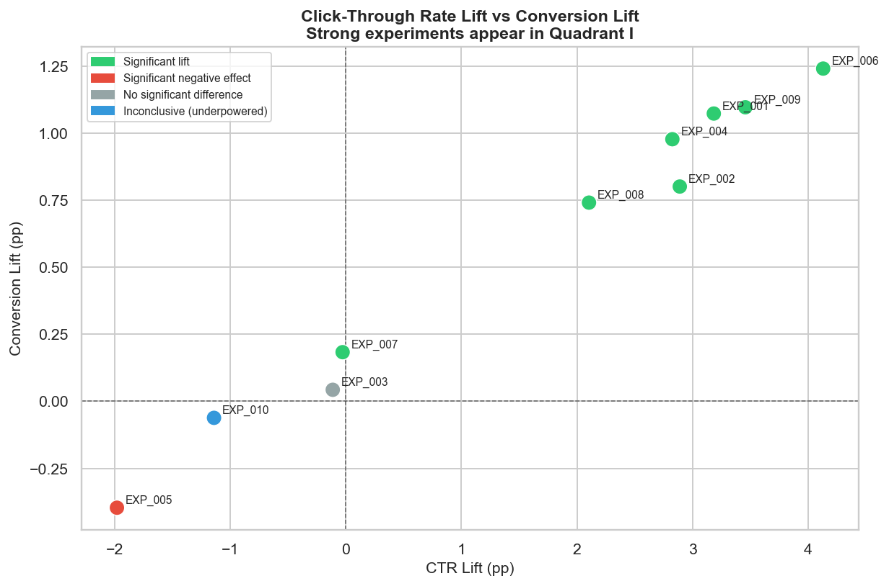

# AB-Test Significance Pipeline

[](https://python.org)
[](https://spark.apache.org)
[](LICENSE)
[]()
[]()

**Automated PySpark + Hive pipeline for hypothesis testing (chi-square, t-test, regression) across concurrent marketing experiments at scale.**

Built to demonstrate the core technical skills required for a **Marketing Measurement Analyst** role: running rigorous statistical tests on large-scale user experiment data, surfacing significant results, and presenting them in a leadership-ready format.

---

## Dashboard

### Executive Summary


### Experiments Ranked by Conversion Lift


### Statistical Significance Matrix


### Monthly Experiment Readout


### Revenue Lift vs Conversion Lift


### CTR Lift vs Conversion Lift


---

## Problem Statement

Marketing teams at scale run **dozens of concurrent A/B experiments** every month — testing email creatives, bid strategies, landing pages, loyalty offers, and more. The challenge is not running a single test; it is building a system that can:

1. Ingest millions of user-level experiment events
2. Automatically run the right statistical tests for each experiment
3. Surface clear verdicts (scale / stop / inconclusive) with evidence
4. Aggregate results into a monthly leadership report across all experiments simultaneously

This pipeline solves that problem end-to-end.

---

## Dataset

**Synthetic, PySpark-generated** — 4.55 million rows across 10 concurrent experiments, 3 months.

| Column | Type | Description |
|---|---|---|
| `user_id` | string | Unique user identifier (per experiment arm) |
| `experiment_id` | string | EXP_001 ... EXP_010 |
| `experiment_name` | string | Human-readable campaign name |
| `variant` | string | `control` or `treatment` |
| `channel` | string | `email`, `display`, `social`, `search`, `app` |
| `exposure_month` | string | `2025-10`, `2025-11`, `2025-12` |
| `clicked` | int | 1 if user clicked the ad |
| `converted` | int | 1 if user converted (primary KPI) |
| `revenue` | float | Revenue generated (0 for non-converters) |

**Design rationale:** Experiments were deliberately engineered with a range of effect sizes — some strong positive lifts, one null effect, one negative — to make the pipeline's significance detection meaningful rather than trivially significant across all tests.

```
Experiment              | Design Effect  | Outcome
------------------------|---------------|----------------------------------
EXP_001 Email Welcome   | +10pp CR lift | Significant lift → Scale
EXP_002 Display Retarg  | +8pp CTR lift | Significant lift → Scale
EXP_003 Social Null     | ~0 effect     | No significant difference → Stop
EXP_004 Search Bids     | +10pp CR lift | Significant lift → Scale
EXP_005 Push Notif.     | -4pp CR       | Significant negative → Stop
EXP_006 Loyalty Offer   | +12pp CR lift | Significant lift → Scale
EXP_007 Cross-sell Marg.| +2pp (small)  | Marginal significance → Scale
EXP_008 Landing Page    | +8pp CR lift  | Significant lift → Scale
EXP_009 Coupon Code     | +10pp CR lift | Significant lift → Scale
EXP_010 Card Upgrade    | 0 effect      | Inconclusive → Monitor
```

---

## Pipeline Architecture

```
src/
 |
 +-- config.py                    Central config: experiments, paths, Spark settings
 |
 +-- 01_generate_data.py          PySpark + numpy: generate 4.55M row synthetic dataset
 |                                Binomial sampling with realistic conversion rates
 |
 +-- 02_hive_setup.py             Write Parquet-based Hive tables, register global temp views
 |                                Tables: ab_events (partitioned by experiment_id)
 |                                        ab_monthly_agg (grouped by month + variant)
 |
 +-- 03_significance_pipeline.py  CORE: reusable run_experiment(df, exp_id) function
 |                                - Chi-square test (conversion, CTR)
 |                                - Welch t-test (revenue)
 |                                - Logistic regression (variant + channel)
 |                                - Verdict + recommended action
 |
 +-- 04_batch_runner.py           Run pipeline across ALL experiments
 |                                Output: master_results.csv, monthly_readout.csv
 |
 +-- 05_dashboard.py              6 matplotlib/seaborn charts (leadership report style)
 |
 +-- run_all.py                   Single entrypoint: runs steps 2 → 3 → 4 in order
```

**Hive integration:** Parquet warehouse + Spark SQL global temp views — equivalent to Hive external tables. All SQL runs via `spark.sql("""HiveQL...""")`. On a production cluster, these would be registered in the Hive metastore and queryable by any Hive-compatible tool.

---

## Statistical Methods

### 1. Chi-Square Test (Binary Metrics)
Used for **conversion rate** and **click-through rate** (binary outcomes: converted or not).

```python
# 2x2 contingency table: [treatment, control] x [converted, not_converted]
stat, p, dof, _ = chi2_contingency(contingency, correction=False)
```

Null hypothesis: conversion rates are equal across variants. Rejection (p < 0.05) indicates a real difference.

### 2. Welch T-Test (Continuous Metric)
Used for **revenue per user** (continuous, unequal variances between groups).

```python
stat, p = ttest_ind(treat_rev, ctrl_rev, equal_var=False)
```

Does not assume equal variance — appropriate for revenue distributions where treatment changes the distribution shape, not just the mean.

### 3. Logistic Regression (Effect Size + Channel Control)
Used to estimate the **treatment effect controlling for channel**. Channels are not perfectly balanced across variants, so a naive comparison can be confounded.

```python
# converted ~ is_treatment + channel_encoded
model = LogisticRegression(max_iter=300, solver="lbfgs")
model.fit(X, y)
odds_ratio = exp(model.coef_[0][0])   # treatment log-odds -> odds ratio
```

The treatment coefficient (log-odds) and odds ratio give the channel-adjusted effect size. A Wald test approximates the p-value.

### 4. Verdict Logic

| Condition | Verdict | Action |
|---|---|---|
| Significant (any test) + positive conv lift | Significant lift | Scale campaign |
| Significant + negative conv lift | Significant negative effect | Stop campaign immediately |
| Significant + near-zero conv lift | Significant revenue lift only | Monitor and extend |
| Not significant + small lift | No significant difference | Stop (no effect) |
| Not significant + non-trivial lift | Inconclusive (underpowered) | Extend experiment |

---

## Master Results Table

Actual results from running the pipeline on the 4.55M row dataset:

| Experiment | Name | Ctrl Conv% | Treat Conv% | Lift | Rel. Lift | p-value | Verdict | Action |
|---|---|---|---|---|---|---|---|---|
| EXP_001 | Email Welcome Series | 3.193% | 4.266% | +1.073pp | +33.6% | <0.0001 | **Significant lift** | Scale |
| EXP_002 | Display Retargeting | 1.806% | 2.607% | +0.801pp | +44.3% | <0.0001 | **Significant lift** | Scale |
| EXP_003 | Social Prospecting Null | 1.510% | 1.553% | +0.043pp | +2.9% | 0.239 | No significant difference | Stop |
| EXP_004 | Search Bid Optimisation | 4.435% | 5.413% | +0.977pp | +22.0% | <0.0001 | **Significant lift** | Scale |
| EXP_005 | Push Notification Negative | 2.200% | 1.804% | -0.397pp | -18.0% | <0.0001 | **Significant negative** | Stop immediately |
| EXP_006 | Loyalty Rewards Offer | 2.760% | 4.001% | +1.240pp | +44.9% | <0.0001 | **Significant lift** | Scale |
| EXP_007 | Cross-sell Email Marginal | 3.489% | 3.673% | +0.183pp | +5.2% | 0.0069 | **Significant lift** | Scale |
| EXP_008 | Landing Page Optimisation | 3.987% | 4.728% | +0.741pp | +18.6% | <0.0001 | **Significant lift** | Scale |
| EXP_009 | Coupon Code Acquisition | 1.983% | 3.079% | +1.096pp | +55.3% | <0.0001 | **Significant lift** | Scale |
| EXP_010 | Card Upgrade Offer | 5.976% | 5.915% | -0.061pp | -1.0% | 0.411 | Inconclusive | Monitor |

**Summary: 7 campaigns to scale, 1 to stop (negative ROI), 1 true null, 1 inconclusive.**

---

## How This Mirrors Real Marketing Analytics

In a real marketing measurement team at a company like American Express, this pipeline replicates the **monthly campaign results reporting process**:

1. **Experiment ingestion** — Events from campaign exposure logs, ad servers, and CRM systems land in Hive tables partitioned by campaign and date.

2. **Automated statistical testing** — The significance pipeline runs on a schedule (monthly or weekly). Any analyst can call `run_experiment(df, "EXP_001")` for a one-off analysis, or `batch_runner` for the full monthly sweep.

3. **Hierarchy of tests** — Chi-square for binary metrics (conversion, CTR) because they are proportions. T-test for revenue because it is continuous and can have skewed distributions. Logistic regression for effect-size estimation controlling for confounders (channel, segment).

4. **Verdict automation** — Rather than requiring an analyst to interpret every p-value, the verdict logic encodes the decision rules (p < 0.05, direction of lift) and outputs an explicit recommended action, reducing interpretation variance across analysts.

5. **Leadership reporting** — The monthly readout chart and executive summary dashboard translate statistical output into a business-friendly format: win rate by month, ranked experiment table, and KPI scorecards.

**Scalability:** The pipeline is parameterised by `experiment_id` — adding a new experiment requires zero code changes. On a production cluster, the Parquet tables would be replaced by Hive managed tables or Delta Lake, and the pipeline would run via Airflow or a similar orchestrator.

---

## Repo Structure

```
ab-test-significance-pipeline/
  README.md
  requirements.txt
  .gitignore
  src/
    config.py                     Experiment definitions + paths + Spark config
    01_generate_data.py           PySpark data generator (4.55M rows, 10 experiments)
    02_hive_setup.py              Parquet Hive tables + global temp view registration
    03_significance_pipeline.py   Core: chi-square + t-test + logistic regression
    04_batch_runner.py            Batch runner: all experiments -> master_results.csv
    05_dashboard.py               6 matplotlib/seaborn dashboard charts
    run_all.py                    Single entrypoint
  dashboard/
    master_results.csv            One row per experiment: all metrics + verdict
    monthly_readout.csv           Win/loss breakdown by month
    01_experiment_ranking.png
    02_significance_matrix.png
    03_monthly_readout.png
    04_revenue_vs_conversion.png
    05_ctr_vs_conversion.png
    06_executive_summary.png
```

---

## How to Run

### Prerequisites
- Python 3.10+
- Java 11+ (for PySpark)
- On Windows: Hadoop winutils in `HADOOP_HOME/bin`

### Setup
```bash
git clone https://github.com/udayvimal/ab-test-significance-pipeline.git
cd ab-test-significance-pipeline
pip install -r requirements.txt
```

### Run full pipeline
```bash
python src/run_all.py
```

Outputs:
- `dashboard/master_results.csv` — master experiment results table
- `dashboard/monthly_readout.csv` — monthly win/loss breakdown
- `dashboard/*.png` — 6 dashboard charts

### Run significance test for a single experiment
```python
import pandas as pd, sys
sys.path.insert(0, "src")
from significance_pipeline import run_experiment

df = pd.read_parquet("warehouse/ab_events")      # or any pandas DataFrame
result = run_experiment(df, experiment_id="EXP_001")
print(result["verdict"], result["recommended_action"])
# "Significant lift"  "Scale campaign"
```

---

## Technologies

| Technology | Usage |
|---|---|
| **PySpark 4.x** | Data generation at scale, Hive table writes, SQL aggregations |
| **Hive (Parquet + SQL)** | Partitioned tables, HiveQL via `spark.sql()` |
| **scipy.stats** | `chi2_contingency`, `ttest_ind` (Welch), `norm.sf` (Wald) |
| **scikit-learn** | `LogisticRegression` for channel-controlled effect estimation |
| **pandas** | In-memory experiment analysis, CSV output |
| **matplotlib / seaborn** | Dashboard generation (6 PNG charts) |
| **numpy** | Binomial sampling, random data generation |

---

## Author

**Uday Vimal** | [github.com/udayvimal](https://github.com/udayvimal)

*Built as a portfolio demonstration for Marketing Measurement Analyst roles requiring PySpark, Hive, and automated hypothesis testing at scale.*
