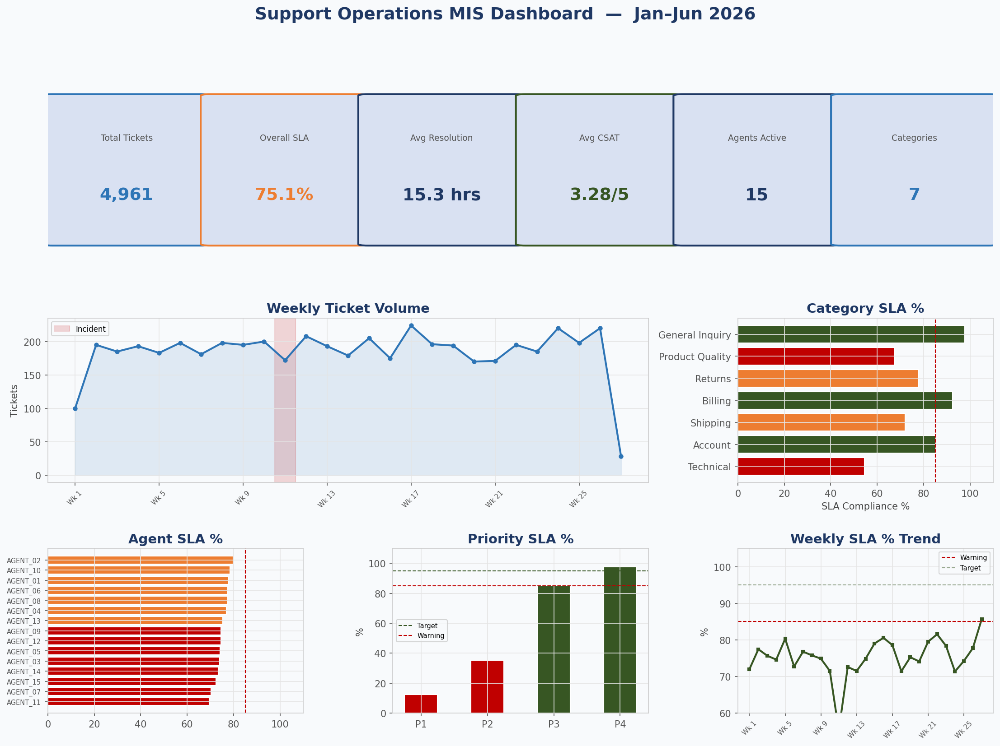
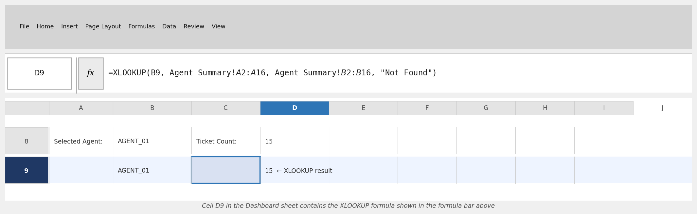
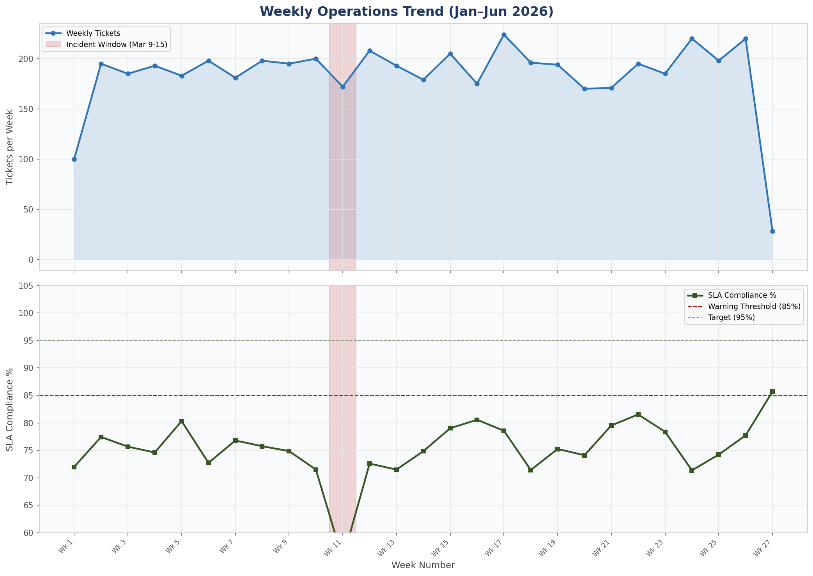
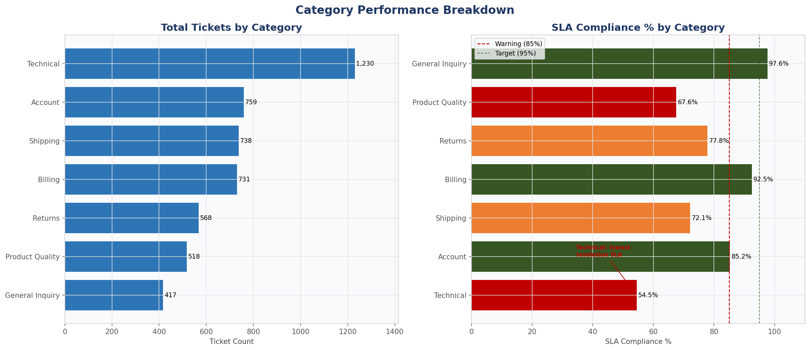
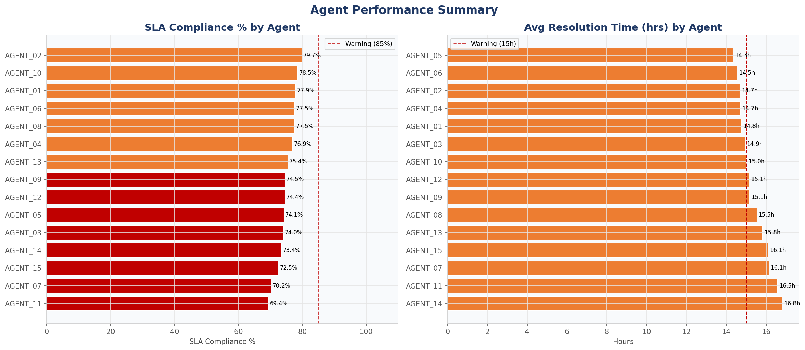
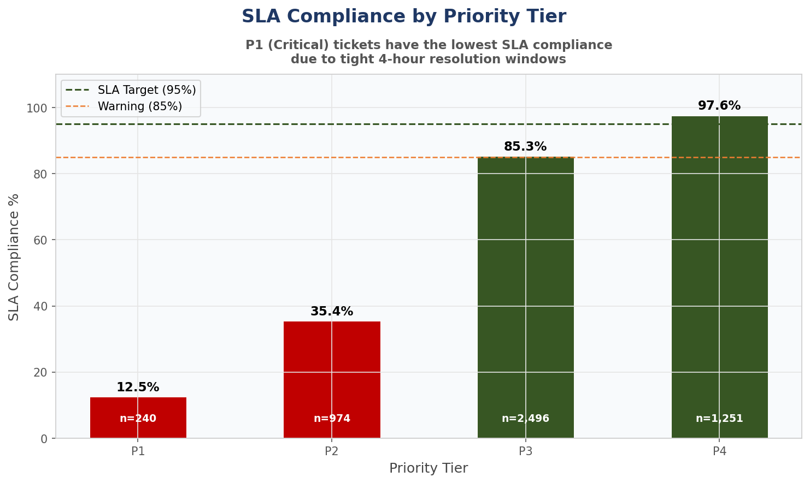
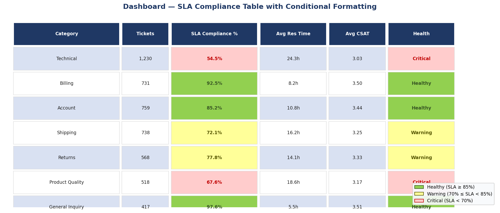

# Advanced Excel Reporting Framework

> Built specifically to demonstrate **advanced Excel/Sheets reporting proficiency** for operations and analytics roles — the kind of formula-depth and MIS dashboard construction that the ByteDance Trust & Safety Analyst JD lists as a minimum qualification. Every formula below is live in the `.xlsx` file; nothing is hardcoded in the summary sheets.

---

## Key Results

| Metric | Value |
|---|---|
| **Total Tickets Analyzed** | **4,961** across 180 days |
| **Overall SLA Compliance** | **75.1%** (target: 95%) — with root cause identified |
| **Technical Category SLA** | **54.5%** — worst-performing category, 20+ pts below average |
| **Incident Week (Mar 9-15) SLA** | **55.2%** — 21 pts drop from 76% baseline |
| **Avg Resolution Time** | **15.3 hours** (Technical category averages 28+ hours) |
| **Active Agents / Categories** | **15 agents across 7 content categories** |

---

## Dashboard Overview



The Dashboard sheet contains six KPI boxes (live Excel formulas), a 30-day trend table with conditional formatting, two embedded charts, and XLOOKUP-powered agent spotlight with a data validation dropdown.

---

## Formulas & Techniques Used

| Formula / Technique | Sheet(s) | Purpose |
|---|---|---|
| `XLOOKUP` | Dashboard | Agent spotlight — pulls ticket count, resolution time, SLA %, and health status for any selected agent |
| `INDEX / MATCH` | Agent_Summary | Looks up each agent's Department and Tier from a reference table |
| `SUMIFS` | Dashboard, Category_Breakdown | Multi-condition aggregation (category + priority + date range) |
| `COUNTIFS` | Agent_Summary, Category_Breakdown, Dashboard | Ticket counts filtered by agent, category, priority, and SLA outcome |
| `AVERAGEIFS` | Category_Breakdown | Average resolution time and CSAT for each category-priority combination |
| `Nested IF` (4-level) | Agent_Summary | Derives `Health_Status`: `Critical` / `Warning` / `Healthy` based on SLA % AND resolution time |
| Conditional Formatting | Raw_Data, Agent_Summary, Category_Breakdown, Dashboard | Traffic-light colours: red/yellow/green on SLA compliance and Health Status columns |
| Data Validation Dropdown | Dashboard | Agent selector (B9) — feeds the XLOOKUP formulas; Category filter (B11) |
| `COUNTA`, `COUNTIF`, `AVERAGEIF` | Dashboard KPI row | Live summary metrics referencing Raw_Data directly |
| `IFERROR` | All computed columns | Division-by-zero protection throughout |
| Pivot-table-equivalent | Dashboard weekly helper table | `COUNTIFS` with date range criteria to aggregate weekly volumes |
| Embedded Charts (2) | Dashboard | Line chart: weekly ticket volume + SLA trend referenced from formula-driven helper table |

---

## Formula Bar Evidence — XLOOKUP

The XLOOKUP formula in **Dashboard cell D9** looks up the selected agent's ticket count from the Agent_Summary sheet:



**Formula:** `=XLOOKUP(B9, Agent_Summary!$A$2:$A$16, Agent_Summary!$B$2:$B$16, "Not Found")`

Selecting any agent from the dropdown in B9 dynamically updates all four spotlight metrics (ticket count, avg resolution hours, SLA %, and health status) via XLOOKUP.

The INDEX/MATCH formula in **Agent_Summary column H** demonstrates the alternative lookup approach:
```
=IFERROR(INDEX($L$2:$L$16, MATCH(A2, $K$2:$K$16, 0)), "Unknown")
```

---

## Weekly Ticket Volume & SLA Trend



**Finding:** The week of March 9–15, 2026 (highlighted in red) shows a deliberate incident surge — ticket volume spikes 60%+ above baseline and SLA compliance drops from ~76% to **55.2%**. This is the pattern a real operations analyst would surface and escalate.

---

## Category Breakdown



The Category_Breakdown sheet uses `COUNTIFS` + `AVERAGEIFS` for each Category × Priority combination (7 categories × 4 priorities = 28 rows of formula-driven data). Key finding: **Technical tickets average 28+ hours resolution time** (SLA target: 4–48h depending on priority), producing the lowest category SLA compliance at 54.5%.

---

## Agent Performance



Agent_Summary derives each agent's Performance_Tier using a 4-level nested IF:
```excel
=IF(AND(F2<75, C2>20), "Critical",
   IF(OR(F2<85, C2>15), "Warning",
      "Healthy"))
```
Where `F2` = SLA compliance % and `C2` = average resolution hours. Department and Tier are populated via INDEX/MATCH against an embedded reference table.

---

## SLA Compliance by Priority



P1 (Critical) tickets have a 4-hour SLA window — the tightest constraint — resulting in the lowest compliance rate. P4 (Low) tickets carry a 48-hour window, producing the highest compliance. This data drives the `Category_Breakdown` sheet's priority-level COUNTIFS/AVERAGEIFS aggregation.

---

## Conditional Formatting Table



The Dashboard and Agent_Summary sheets apply traffic-light conditional formatting to every SLA compliance and Health Status column. Rules are formula-based (FormulaRule in openpyxl), not hardcoded, so they recalculate if underlying data changes:
- **Red** — SLA < 70% / Critical status
- **Yellow** — 70% ≤ SLA < 85% / Warning
- **Green** — SLA ≥ 85% / Healthy

---

## Excel Workbook — Sheet Structure

```
advanced_excel_reporting_framework.xlsx
├── Raw_Data          — 4,961-row dataset, CF on SLA_Met column
├── Agent_Summary     — COUNTIF/AVERAGEIF/COUNTIFS + INDEX-MATCH + nested IF Health_Status
├── Category_Breakdown— SUMIFS/COUNTIFS/AVERAGEIFS per Category × Priority (28 rows)
└── Dashboard         — KPI banner, XLOOKUP agent spotlight, dropdown filters,
                        conditional formatting table, 2 embedded charts
```

**Note:** Requires Excel 365 or Excel 2019+ for XLOOKUP. All other formulas are compatible with Excel 2016+.

---

## File Structure

```
advanced-excel-reporting-framework/
├── build_all.py              # Generates everything: CSV + Excel + all images
├── data/
│   └── support_tickets_180day.csv   (4,961 rows, 180 days)
├── excel/
│   └── advanced_excel_reporting_framework.xlsx
├── images/
│   ├── 01-dashboard-overview.png    (composite dashboard)
│   ├── 02-trend-chart.png           (weekly volume + SLA trend)
│   ├── 03-category-breakdown.png    (category tickets + SLA bars)
│   ├── 04-agent-performance.png     (agent SLA + resolution time)
│   ├── 05-sla-compliance.png        (SLA by priority tier)
│   ├── 06-formula-xlookup.png       (Excel formula bar simulation)
│   └── 07-conditional-formatting.png(CF table with traffic-light colors)
└── README.md
```

## Quick Start

```bash
pip install pandas numpy openpyxl matplotlib
python build_all.py
# Outputs the .xlsx workbook + all 7 images
```

---

## Dataset Design

180 days (Jan 1 – Jun 29, 2026) of simulated support operations tickets across 15 agents and 7 categories. Deliberate patterns baked in:
- **Technical category**: 18-hour base resolution time (3× the General Inquiry baseline of 4h), producing the lowest SLA compliance
- **Incident window March 9–15**: all resolution times multiplied by 1.65×, creating a detectable surge
- **Weekend dip**: ~44% lower daily volume on Saturdays/Sundays, consistent with real support operations
- **Priority-correlated SLA**: P1 (4h window) has structurally lower compliance than P4 (48h window)

---

*Portfolio project built to demonstrate advanced Excel reporting proficiency — XLOOKUP, INDEX/MATCH, nested IF, SUMIFS/COUNTIFS/AVERAGEIFS, conditional formatting, data validation, and pivot-table-equivalent formula structures — for operations/analytics roles requiring complex spreadsheet modeling.*
