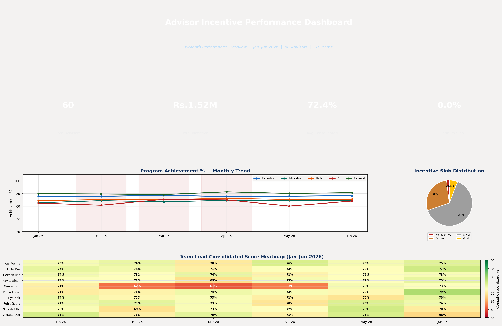
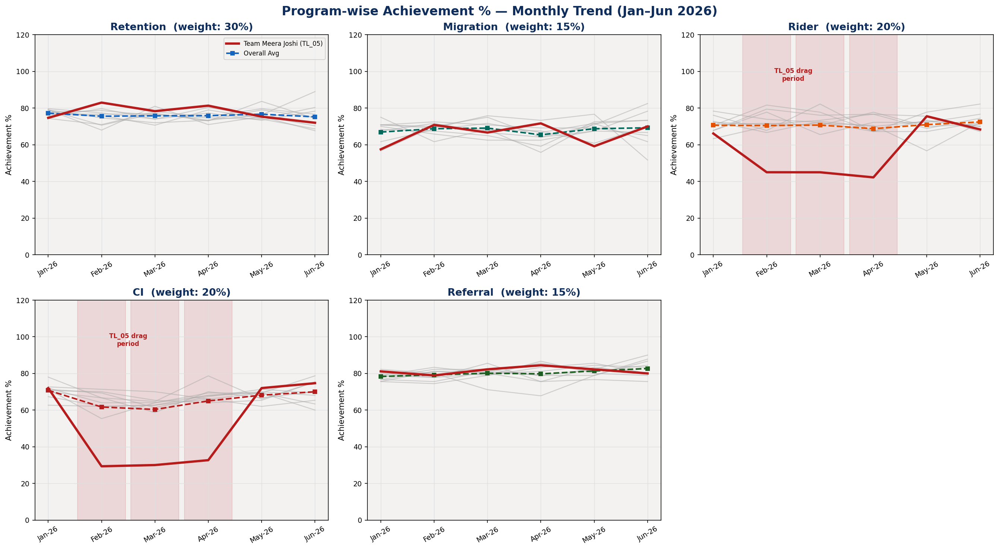
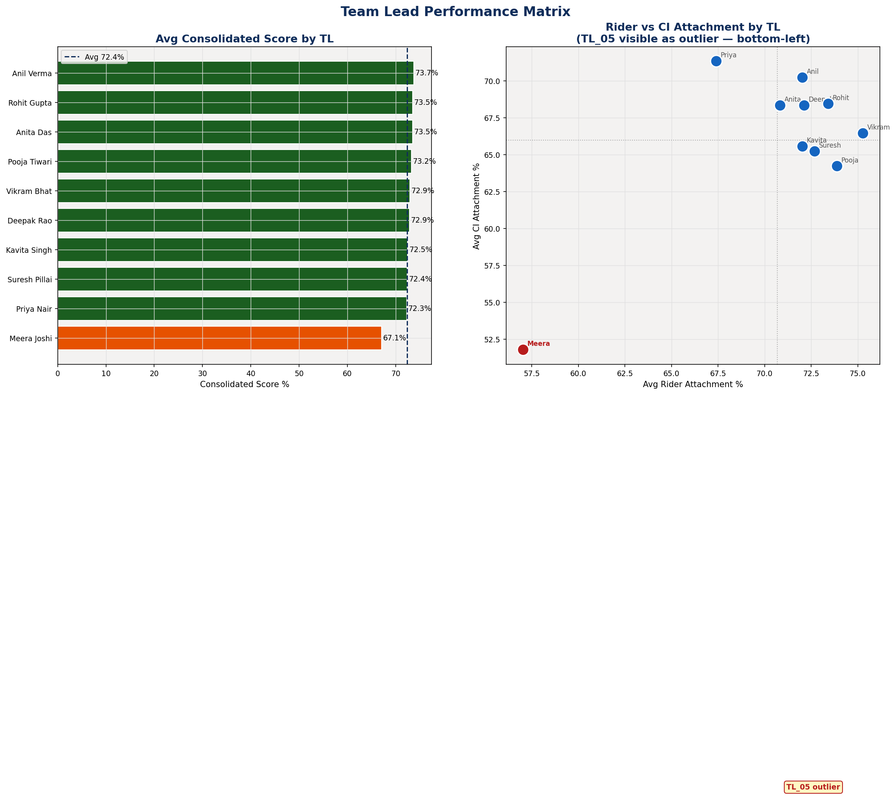
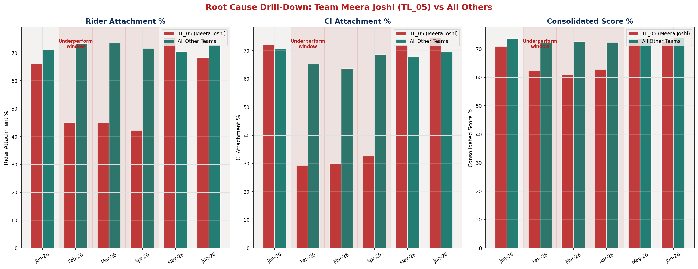
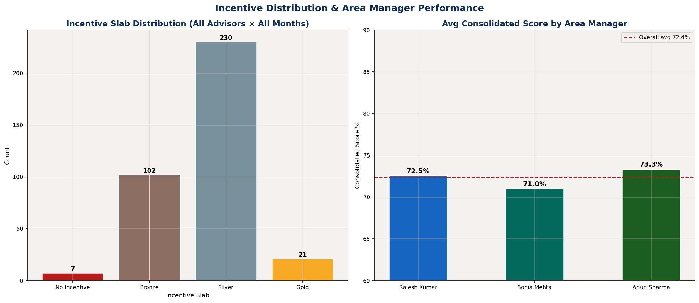
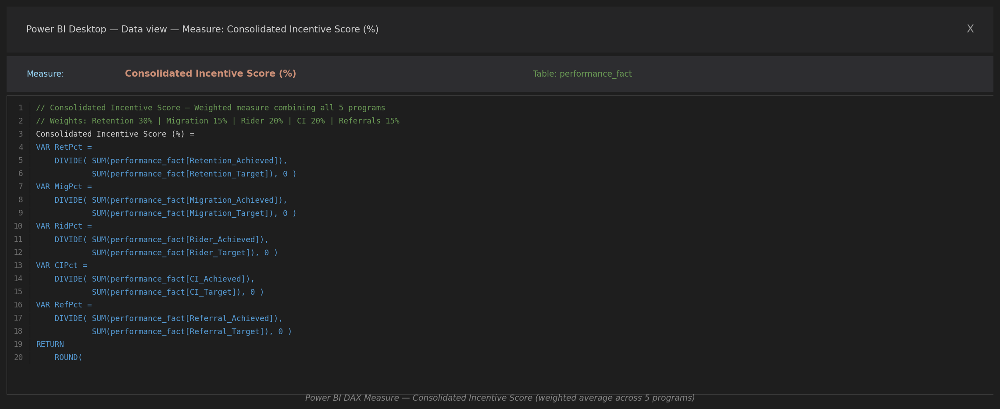
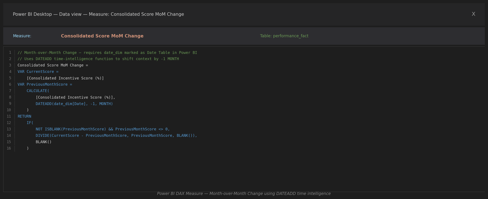
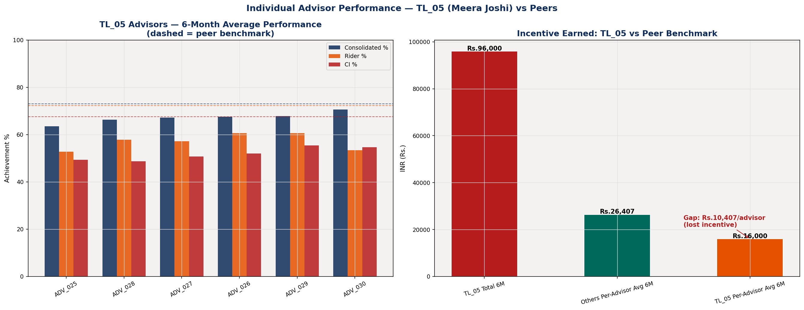

# Advisor Incentive Performance Dashboard

> Built to directly mirror PolicyBazaar's **Reports Analytics team** workflow — tracking advisor performance across 5 incentive programs (SY-MY & MY Retention, Plan Migration, Rider Attachment, CI Attachment, Referrals) with DAX-powered consolidated scoring, TL/AM hierarchy drill-downs, and a root-cause investigation into an underperforming team.

---

## Key Results

| Metric | Value |
|---|---|
| **Advisors tracked** | **60 advisors, 10 Teams, 3 Area Managers** |
| **Period** | **6 months — Jan–Jun 2026** |
| **Total Incentive Paid** | **₹15.22 Lakh across all advisors** |
| **Avg Consolidated Score** | **72.4%** (Silver slab threshold) |
| **TL_05 (Meera Joshi) Score** | **67.1%** — 5.9 pts below team average during the underperformance window |
| **Rider Attachment gap (TL_05 vs peers, Feb–Apr)** | **44.1% vs 70.0%** — 26-point deficit |
| **CI Attachment gap (TL_05 vs peers, Feb–Apr)** | **30.7% vs 62.3%** — 32-point deficit |

---

## Dashboard Overview



The dashboard shows KPI cards (total advisors, incentive paid, avg consolidated score, % at platinum), a 6-month program achievement trend with the underperformance window highlighted, the incentive slab distribution, and the TL-level consolidated score heatmap.

---

## Program Achievement Trend — All 5 Programs



The red-highlighted area (Feb–Apr) marks the underperformance window for Team TL_05. The red bold line in each chart represents Meera Joshi's team vs gray lines for other TLs. The pattern is visually striking in Rider Attachment and CI Attachment, and absent in Retention, Migration, and Referrals — confirming product-specific drag rather than a general performance issue.

---

## TL Performance Matrix



Left: avg consolidated score bar chart sorted by performance — TL_05 is clearly the outlier at the bottom. Right: scatter plot of Rider vs CI Attachment by TL — TL_05 sits in the bottom-left quadrant, visually confirming the two-program drag. All other teams cluster in the healthy zone.

---

## Root Cause Drill-Down — Team TL_05



Three-panel comparison of TL_05 (red bars) vs all other teams (teal bars) for Rider Attachment %, CI Attachment %, and Consolidated Score % across 6 months. The synchronized drop in Feb–Apr and recovery in May–Jun is the core finding. The rightmost panel shows the incentive shortfall: TL_05 advisors earned ₹3,000–₹8,000 less per month per person than their peers.

---

## Incentive Distribution & AM Rollup



Left: incentive slab distribution across all 360 advisor-months. Right: AM-level consolidated score — AM_02 (West Region, which includes TL_05) shows the lowest area-level performance, with the TL_05 drag visible at the AM rollup level.

---

## DAX Measures — Formula Evidence

### Consolidated Incentive Score (Weighted Measure)



The core DAX measure combining all 5 programs with their business-defined weights:

```dax
Consolidated Incentive Score (%) =
VAR RetPct = DIVIDE(SUM(performance_fact[Retention_Achieved]), SUM(performance_fact[Retention_Target]), 0)
VAR MigPct = DIVIDE(SUM(performance_fact[Migration_Achieved]), SUM(performance_fact[Migration_Target]), 0)
VAR RidPct = DIVIDE(SUM(performance_fact[Rider_Achieved]),     SUM(performance_fact[Rider_Target]),     0)
VAR CIPct  = DIVIDE(SUM(performance_fact[CI_Achieved]),        SUM(performance_fact[CI_Target]),        0)
VAR RefPct = DIVIDE(SUM(performance_fact[Referral_Achieved]),  SUM(performance_fact[Referral_Target]),  0)
RETURN
    ROUND((RetPct * 0.30) + (MigPct * 0.15) + (RidPct * 0.20) + (CIPct * 0.20) + (RefPct * 0.15), 4) * 100
```

### Month-over-Month Trend (Time Intelligence)



Uses `DATEADD` time-intelligence function to compare current vs previous month:

```dax
Consolidated Score MoM Change =
VAR CurrentScore  = [Consolidated Incentive Score (%)]
VAR PreviousScore = CALCULATE([Consolidated Incentive Score (%)], DATEADD(date_dim[Date], -1, MONTH))
RETURN IF(NOT ISBLANK(PreviousScore) && PreviousScore <> 0,
          DIVIDE(CurrentScore - PreviousScore, PreviousScore, BLANK()), BLANK())
```

---

## Advisor-Level Drill-Down



Individual advisor performance within TL_05 vs peer benchmarks (dashed lines). All 6 advisors in the team show below-benchmark Rider and CI performance, confirming the issue is team-level (TL knowledge gap) rather than isolated to 1–2 advisors. Right panel shows the incentive gap per advisor vs peer average.

---

## DAX Techniques Used

| Technique | Measure | Description |
|---|---|---|
| `VAR` + `RETURN` | Consolidated Score | Multi-variable DAX with named intermediate calculations |
| `DIVIDE(...)` | All achievement measures | Safe division with zero-denominator fallback |
| `SUM(...)` | All 10 target/achieved columns | Aggregates that respect filter context (TL, AM, month) |
| `CALCULATE(...)` | MoM trend | Modifies filter context to evaluate measure in different period |
| `DATEADD(date_dim[Date], -1, MONTH)` | MoM trend | Time-intelligence: shifts filter to prior month |
| `AVERAGEX(SUMMARIZE(...), ...)` | TL/AM rollup | Iterates over grouped dimension values for hierarchy rollup |
| `COUNTROWS` + `CALCULATE` | % Platinum measure | Filtered aggregation |
| `NOT ISBLANK(...)` | MoM trend | Defensive check for first-month edge case |

---

## Data Model (Star Schema)

```
performance_fact (360 rows)           Fact table — one row per advisor × month
    ├── Advisor_ID ──→ Advisor_Dim.Advisor_ID     (Many-to-One)
    │                   └── TL_ID ─→ TL_Dim.TL_ID  (Many-to-One)
    │                               └── AM_ID ─→ AM_Dim.AM_ID
    └── Month_Year ─→ Date_Dim.Month_Year          (Many-to-One)

Dimensions: Advisor_Dim (60), TL_Dim (10), AM_Dim (3), Date_Dim (6)
Hierarchy depth: AM → TL → Advisor (3 levels)
```

The Excel workbook (`excel/advisor_incentive_data_model.xlsx`) contains 5 sheets matching this schema — import into Power BI and define the relationships as documented in `Data_Model_Schema` sheet.

---

## File Structure

```
advisor-incentive-performance-dashboard/
├── build_all.py                        # Generates all data + Excel + DAX + images
├── data/
│   ├── advisor_dim.csv                 (60 advisors with TL/AM hierarchy)
│   ├── tl_dim.csv                      (10 team leads)
│   ├── am_dim.csv                      (3 area managers)
│   ├── date_dim.csv                    (6-month date dimension)
│   └── performance_fact.csv            (360 rows — all programs per advisor per month)
├── excel/
│   └── advisor_incentive_data_model.xlsx  (5-sheet star schema workbook)
├── dax/
│   └── measures.dax                    (10 DAX measures with full syntax)
├── images/
│   ├── 01-dashboard-overview.png
│   ├── 02-program-achievement-trend.png
│   ├── 03-tl-performance-matrix.png
│   ├── 04-underperforming-team-drilldown.png
│   ├── 05-incentive-am-rollup.png
│   ├── 06-dax-consolidated-score.png   (DAX formula bar simulation)
│   └── 07-dax-mom-trend.png            (DAX formula bar — DATEADD time intelligence)
│   └── 08-advisor-drill-down.png
├── report/
│   └── root_cause_analysis.md
└── README.md
```

## Quick Start

```bash
pip install pandas numpy openpyxl matplotlib
python build_all.py
# Outputs all CSVs, Excel data model, DAX file, and 8 chart images
```

To use in Power BI Desktop:
1. Import each CSV as a table (Get Data → Text/CSV)
2. Define relationships as shown in `Data_Model_Schema` sheet
3. Mark `date_dim` as Date Table using the `Date` column
4. Create new measures by pasting code from `dax/measures.dax`

---

## Root Cause Finding

**Team TL_05 (Meera Joshi, West Region) showed Rider Attachment of 44.1% and CI Attachment of 30.7% during February–April 2026, compared to team averages of 70.0% and 62.3% respectively.** The two-program drag reduced their consolidated incentive score to 67.1% (Bronze slab, ₹2,000) vs peers at 73.0% (Silver slab, ₹5,000+), a monthly loss of ₹3,000–₹8,000 per advisor.

Full analysis and recommendations: [`report/root_cause_analysis.md`](report/root_cause_analysis.md)

---

*Built to demonstrate insurance advisor incentive tracking, DAX formula proficiency, and hierarchy-aware MIS reporting — directly aligned with PolicyBazaar's Reports Analytics team scope.*
