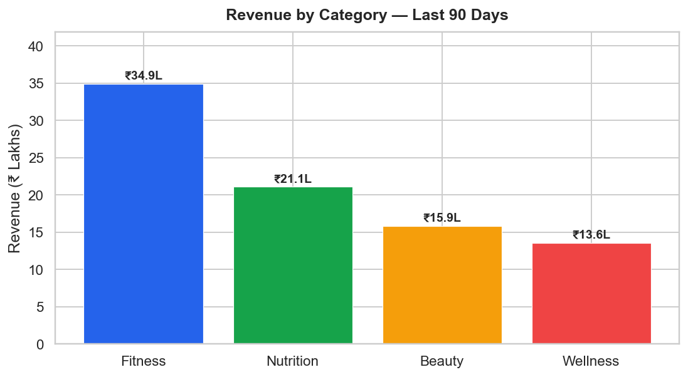
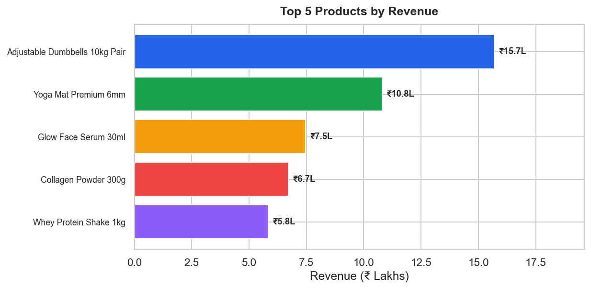
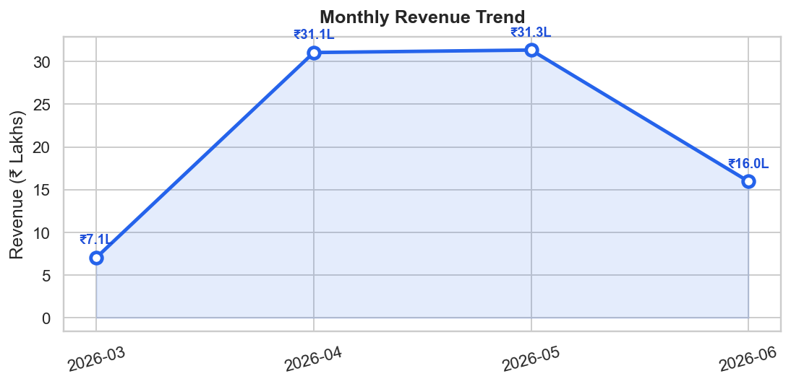
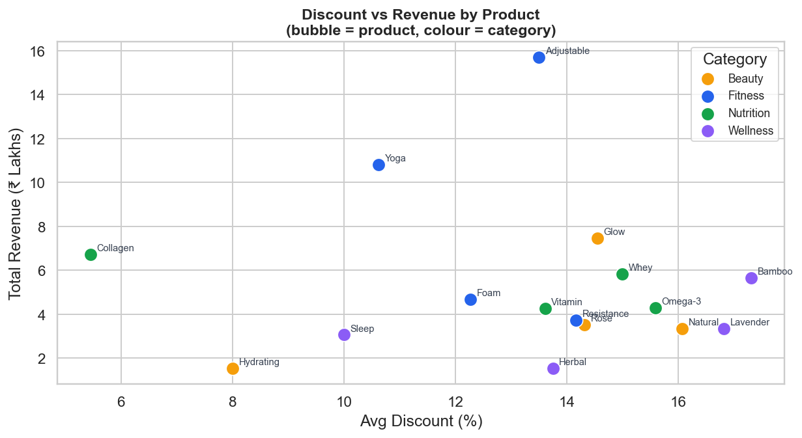
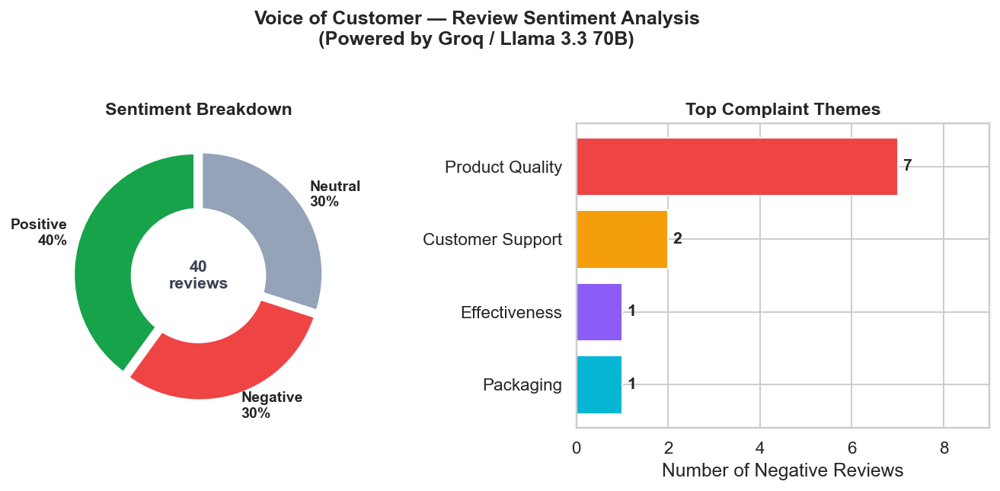

# AI Business Reporting & Sentiment Analysis

[](https://python.org)
[](https://console.groq.com)
[](https://n8n.io)
[](LICENSE)
[]()

> **An automated AI pipeline that reads raw sales and review data, reasons over it using Groq's Llama 3.3 70B LLM, and writes complete business reports and sentiment summaries — replacing hours of manual analyst work in under 30 seconds.**

---

## What It Does

| Branch | Input | AI Task | Output |
|---|---|---|---|
| **A — Business Reporting** | `sales_data.csv` (200 rows) | LLM writes executive summary + 3 strategic insights grounded in real metrics | `business_report.md` |
| **B — Sentiment Analysis** | `reviews.csv` (40 reviews) | LLM classifies sentiment per review, extracts complaint themes, writes Voice of Customer summary | `sentiment_report.md` |

Both branches run as **standalone Python scripts** or as a **scheduled n8n automation workflow** (importable from `n8n/workflow.json`).

---

## Live Results — Powered by Groq API (Llama 3.3 70B)

### Branch A: Business Performance Dashboard

**Revenue by Category**


**Top 5 Products by Revenue**


**Monthly Revenue Trend**


**Discount vs Revenue Scatter**


---

### Branch B: Sentiment Analysis Dashboard

**Sentiment Breakdown & Top Complaint Themes**


---

## Actual LLM Output (Groq — Llama 3.3 70B)

These are the **real responses** generated by calling `gsk_...` Groq API on the synthetic dataset — not mock placeholders.

### Branch A — AI-Generated Executive Summary

> *"The D2C business has generated a total revenue of ₹8,544,057.60 over the last 90 days, with the fitness category being the top performer, accounting for ₹3,490,522 in revenue. The best month for sales was May 2026, with a revenue of ₹3,134,958. A key trend observed is the significant increase in revenue from March 2026 to April 2026, with a growth of ₹2,399,977. This suggests that the business has been able to recover from a slow start in March and has been able to maintain a strong sales momentum since then. The average discount offered during this period was 13.3%, with some products like the Bamboo Diffuser and Lavender Essential Oil having higher average discounts."*

### Branch A — AI-Generated Insights

> **1. Optimize Pricing Strategy for Top-Performing Products**
> The Adjustable Dumbbells 10kg Pair and Yoga Mat Premium 6mm are the top two revenue-generating products, with sales of ₹1,570,007 and ₹1,080,724 respectively. To maximize revenue, we should consider optimizing the pricing strategy for these products, potentially reducing discounts to increase profit margins.
>
> **2. Invest in Fitness Category Growth**
> The fitness category has been the top performer, accounting for ₹3,490,522 in revenue and 3,026 units sold. We should consider investing in marketing and product development initiatives to further grow this category, potentially expanding our product offerings or increasing our marketing spend to attract more customers.
>
> **3. Analyze and Adjust Discounting Strategy for Most Discounted Products**
> The Bamboo Diffuser and Lavender Essential Oil have average discounts of 17.3% and 16.8% respectively, which may be eroding profit margins. We should analyze the sales data to determine if the high discounts are necessary to drive sales, and adjust our discounting strategy accordingly.

→ Full report: [business_report.md](business_report.md)

---

### Branch B — AI-Generated Voice of Customer Summary

> *"The customer sentiment analysis reveals a mixed bag of opinions, with 40% of customers expressing satisfaction, while 30% have raised concerns, indicating areas that require immediate attention to improve overall customer experience."*

> **Top 3 Recurring Customer Complaints (LLM-extracted):**
> - **Product Quality:** Customers have reported issues with products being faulty or not meeting expectations — clumpy collagen powder, broken seals, ineffective formulas.
> - **Customer Support:** Some customers have expressed frustration with unresponsive customer support, citing delayed or no responses after 4–5 days.
> - **Effectiveness:** A few customers reported that products have not delivered promised benefits, leading to disappointment and mistrust.

> **LLM Recommended Actions:**
> - *Product team:* Conduct a thorough review of the production process for highest-risk products (Adjustable Dumbbells 50% negative, Bamboo Diffuser 50% negative, Collagen Powder 33% negative).
> - *Marketing team:* Revise product listings to include clear information about ingredients, usage, and potential allergens to manage expectations.
> - *Cross-functional:* Develop a responsive customer support process with timely responses to reduce negative reviews and returns.

→ Full report: [sentiment_report.md](sentiment_report.md)

---

## n8n Automation Workflow

The full pipeline runs as a **scheduled n8n workflow** — no manual intervention needed.

```
┌─────────────────────────────────────────────────────────────────┐
│                    n8n Workflow (Every Monday 9am)              │
│                                                                 │
│  [Schedule Trigger]                                             │
│         │                                                       │
│         ├──► [Read sales_data.csv]                              │
│         │         │                                             │
│         │    [Compute Metrics] ──► [Groq LLM: Write Report]    │
│         │                               │                       │
│         │                     [Format Report]                   │
│         │                               │                       │
│         │                     [Save business_report.md]         │
│         │                                                       │
│         └──► [Read reviews.csv]                                 │
│                   │                                             │
│             [Parse Reviews] ──► [Groq LLM: Classify Sentiment] │
│                                        │                        │
│                               [Aggregate Sentiment]             │
│                                        │                        │
│                               [Save sentiment_report.md]        │
└─────────────────────────────────────────────────────────────────┘
```

**Import the workflow:** n8n → Workflows → Import from file → `n8n/workflow.json`

**Configure Groq in n8n** as an OpenAI-compatible credential:
- Base URL: `https://api.groq.com/openai/v1`
- API Key: your Groq key (free at [console.groq.com](https://console.groq.com))
- Model: `llama-3.3-70b-versatile`

### n8n Screenshots
> Add your n8n screenshots to the `screenshots/` folder.

| View | File |
|---|---|
| Full workflow canvas | `screenshots/workflow_canvas.png` |
| LLM node config | `screenshots/llm_node_config.png` |
| Execution log | `screenshots/execution_log.png` |

---

## Key Metrics (From Real Pipeline Run)

| Metric | Value |
|---|---|
| Total Revenue (90 days) | **₹8,544,057.60** |
| Total Units Sold | **12,278** |
| Avg Discount Applied | **13.3%** |
| Top Category | **Fitness — ₹34.9L** |
| Top Product | **Adjustable Dumbbells — ₹15.7L** |
| Best Month | **May 2026 — ₹31.3L** |
| Reviews Analysed | **40** |
| Positive Sentiment | **40% (16 reviews)** |
| Negative Sentiment | **30% (12 reviews)** |
| Top Complaint Theme | **Product Quality (7 reviews)** |
| Highest-Risk SKU | **Adjustable Dumbbells (50% negative)** |

---

## How This Mirrors Real AI Analyst Work

| Manual process (analyst today) | This pipeline |
|---|---|
| Download CSV, open Excel, build pivot tables | `pandas` auto-computes top sellers, trends, discounts |
| Write summary paragraph by hand — 30–60 min | Groq LLM writes executive summary in ~3 seconds |
| Read all reviews one-by-one to categorise | LLM batch-classifies all 40 reviews in one API call |
| Write VoC report with complaint themes | LLM extracts themes + recommended actions automatically |
| Format everything into a Word/Notion doc | Clean Markdown output — paste directly into any tool |
| Run again next month from scratch | n8n schedule trigger automates the full loop every Monday |

**Time saved per cycle: 2–4 hours → under 30 seconds.**

---

## Project Structure

```
ai-business-reporting-sentiment/
├── src/
│   ├── generate_data.py          # Synthetic D2C sales + review CSVs
│   ├── llm_client.py             # Groq | OpenAI | mock fallback wrapper
│   ├── 01_business_reporting.py  # Branch A: metrics → LLM → business_report.md
│   ├── 02_sentiment_analysis.py  # Branch B: reviews → LLM → sentiment_report.md
│   └── 03_generate_charts.py     # 5 result charts exported as PNGs
├── data/
│   ├── sales_data.csv            # 200 rows: product, category, price, discount, units, revenue, date
│   └── reviews.csv               # 40 reviews: product, sentiment_label, review_text
├── charts/                       # Auto-generated result charts
│   ├── 01_revenue_by_category.png
│   ├── 02_top_products.png
│   ├── 03_monthly_trend.png
│   ├── 04_sentiment_analysis.png
│   └── 05_discount_vs_revenue.png
├── n8n/
│   └── workflow.json             # Importable n8n automation workflow
├── screenshots/                  # Add your n8n screenshots here
├── business_report.md            # Live LLM-generated business report
├── sentiment_report.md           # Live LLM-generated sentiment report
├── requirements.txt
├── .env.example
└── .gitignore
```

---

## How to Run

### 1. Clone and install
```bash
git clone https://github.com/udayvimal/ai-business-reporting-sentiment.git
cd ai-business-reporting-sentiment
pip install -r requirements.txt
```

### 2. Add your Groq API key
```bash
cp .env.example .env
# Edit .env:
# LLM_PROVIDER=groq
# GROQ_API_KEY=your_key_here
```
> **No key?** Scripts run in mock mode and still produce complete sample reports.

### 3. Run the full pipeline
```bash
python src/generate_data.py        # Create data CSVs
python src/01_business_reporting.py  # → business_report.md
python src/02_sentiment_analysis.py  # → sentiment_report.md
python src/03_generate_charts.py     # → charts/*.png
```

---

## LLM Provider Support

| Provider | Model | Speed | Cost |
|---|---|---|---|
| **Groq** (recommended) | `llama-3.3-70b-versatile` | ~2–3s per call | Free tier |
| OpenAI | `gpt-4o-mini` | ~5–8s per call | Pay-per-token |
| Mock (no key) | Pre-written response | Instant | Free |

---

## Stack

| Tool | Role |
|---|---|
| **Groq API** | LLM inference — Llama 3.3 70B for report generation and sentiment |
| **Python 3.10** | Data processing and LLM orchestration |
| **pandas / numpy** | Metrics computation from raw CSV |
| **matplotlib / seaborn** | Result chart generation |
| **python-dotenv** | API key management via `.env` |
| **n8n** | Scheduled workflow automation |

---

## Author

**Uday Vimal** | [github.com/udayvimal](https://github.com/udayvimal)

*Built as a portfolio project for AI Analyst internship roles — demonstrating LLM-powered business automation end-to-end.*
