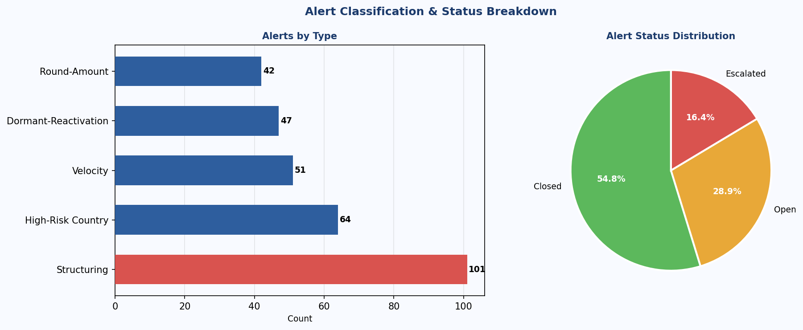

# AML Transaction Monitoring MIS Report

> Built to directly mirror American Express's **AML Compliance MIS Apprentice** workflow — multi-source transaction monitoring across 1,734 transactions, 305 alerts, and 300 customer risk profiles, with XLOOKUP/INDEX-MATCH cross-source joins, COUNTIFS/SUMIFS weekly and monthly trend reports, SLA breach conditional formatting, a 4-level nested IF data quality flag, and an ad-hoc dropdown scorecard.

---

## Key Results

| Metric | Value |
|---|---|
| **Monitoring period** | **120 days — Jan 1 to Apr 30, 2026** |
| **Total transactions monitored** | **1,734** |
| **Total alerts generated** | **305** |
| **Alert rate** | **17.6%** |
| **Structuring alerts (spike week)** | **Week 6 (Feb 9–15) — 20 customers × 4–6 txns below $10K threshold** |
| **SLA breaches (resolution > 7 days)** | **Flagged with conditional formatting in Weekly MIS** |
| **Data quality flags — CRITICAL (no risk profile)** | **Identified via XLOOKUP returning "Not Found"** |
| **KYC Expired/Pending transactions** | **Flagged via 4-level nested IF in Consolidated_View!P** |
| **Orphaned alert records (DQ issue)** | **10 alerts with no matching Transaction_ID** |

---

## Dashboard Overview


KPI cards (total transactions, total alerts, open/escalated, structuring alerts), weekly alert trend with structuring spike highlighted, alert type breakdown, and data quality flag distribution. The spike in Week 6 from 20 structuring customers is clearly visible.

---

## Weekly Alert Trend — Structuring Spike


Stacked bar by week: non-structuring (blue) and structuring (red). **Week 6 (Feb 9–15)** shows an anomalous structuring spike — 20 customers each made 4–6 cash/wire transactions of $9,000–$9,999 within a 7-day window, staying below the $10,000 CTR reporting threshold. All 20 customers carry a High risk rating in the customer master. Recommended action: file Suspicious Activity Reports (SARs) and escalate.

---

## Alert Type & Status Breakdown



Left: horizontal bar by alert type — Structuring, Velocity, High-Risk Country, Round-Amount, Dormant-Reactivation. Right: status distribution (Closed / Open / Escalated). The structuring cluster drives the disproportionate Structuring share during the spike week.

---

## Formula Evidence — Multi-Source Joins


**Consolidated_View sheet** joins all three source tables with live formulas:

```excel
-- Risk_Rating (XLOOKUP across sheets) --
=XLOOKUP(B2, Raw_Risk_Profiles!$A:$A, Raw_Risk_Profiles!$B:$B, "Not Found")

-- Customer_Segment (INDEX-MATCH technique) --
=IFERROR(INDEX(Raw_Risk_Profiles!$E:$E, MATCH(B2, Raw_Risk_Profiles!$A:$A, 0)), "Unknown")

-- Alert_ID (XLOOKUP: transaction → alert join) --
=IFERROR(XLOOKUP(A2, Raw_Alerts!$B:$B, Raw_Alerts!$A:$A), "No Alert")

-- Data Quality Flag (4-level nested IF) --
=IF(H2="Not Found","CRITICAL: No Risk Profile",
   IF(I2="Missing","WARN: Missing KYC",
      IF(I2="Expired","WARN: KYC Expired",
         IF(I2="Pending","INFO: KYC Pending","OK"))))
```

---

## Excel Workbook Structure

| Sheet | Content | Key Formulas |
|---|---|---|
| `Raw_Transactions` | 1,734 transaction records (Jan–Apr 2026) | — |
| `Raw_Risk_Profiles` | 300 customer risk profiles | CF: risk rating traffic-light |
| `Raw_Alerts` | 305 alert records with type, status, resolution | — |
| `Consolidated_View` | All 3 sources joined per transaction | XLOOKUP, INDEX-MATCH, 4-level nested IF |
| `Weekly_MIS_Report` | 18-week trend by alert type + SLA breach | COUNTIFS, SUMIFS, AVERAGEIFS |
| `Monthly_MIS_Report` | Jan–Apr summary with MoM % change | COUNTIFS + MoM delta formula |
| `Ad_Hoc_Scorecard` | Pivot-style table with alert type dropdown | COUNTIFS with dynamic $B$3 filter |
| `Dashboard` | KPI cards, weekly trend table, monthly summary, DQ flag count | Summary formulas + CF rules |

---

## Data Quality Checks

Full write-up: [`report/data_quality_notes.md`](report/data_quality_notes.md)

| Check | Finding | Severity |
|---|---|---|
| Orphaned alerts | 10 alerts reference Transaction_IDs not in transactions table | High |
| Duplicate transactions | 5 near-duplicate records (same customer/date/amount) | Medium |
| Missing risk profiles | Customers with no profile → "CRITICAL: No Risk Profile" flag | High |
| Expired/Pending KYC | Transactions from customers with non-current KYC → WARN/INFO flag | Medium |

All flags surfaced in `Consolidated_View` column P using the 4-level nested IF formula. Red/yellow/blue/green conditional formatting applied to the flag column.

---

## Structuring Pattern — AML Finding

During weekly trend analysis, **Week 6 (Feb 9–15, 2026)** showed a spike in Structuring alerts. Investigation revealed **20 customers** each made 4–6 cash deposits or wire transfers of **$9,000–$9,999** within the same 7-day window — a textbook structuring pattern designed to stay below the $10,000 Currency Transaction Report (CTR) threshold.

All 20 customers are already classified as **High Risk** in the customer master. This cross-source insight was surfaced by joining `Raw_Transactions` with `Raw_Risk_Profiles` via XLOOKUP in `Consolidated_View`.

---

## Data Sources

| File | Rows | Description |
|---|---|---|
| `data/transactions.csv` | 1,734 | Transaction records — ID, Customer, Date, Amount, Channel, Country, MCC |
| `data/customer_risk_profile.csv` | 300 | Customer master — Risk Rating, KYC Status, Segment, Account Age |
| `data/alerts_log.csv` | 305 | Alert records — Alert ID, Transaction ID, Type, Date, Status, Resolution Days |

---

## File Structure

```
aml-transaction-monitoring-mis/
├── build_all.py                           # Data generation + Excel + images
├── data/
│   ├── transactions.csv                   (1,734 rows — 120-day transaction log)
│   ├── customer_risk_profile.csv          (300 customers — risk, KYC, segment)
│   └── alerts_log.csv                     (305 alerts — type, status, resolution)
├── excel/
│   └── aml_transaction_monitoring_mis.xlsx   (8-sheet MIS workbook)
├── images/
│   ├── 01-dashboard-overview.png
│   ├── 02-weekly-trend-chart.png
│   ├── 03-alert-type-breakdown.png
│   └── 04-formula-view.png
├── report/
│   └── data_quality_notes.md              (4 DQ checks with detection formulas)
└── README.md
```

## Quick Start

```bash
pip install pandas numpy openpyxl matplotlib
python build_all.py
# Generates all 3 CSVs, Excel workbook (8 sheets), and 4 chart images
```

---

## Excel Formula Techniques Demonstrated

| Technique | Sheet | Description |
|---|---|---|
| `XLOOKUP` | Consolidated_View | Cross-sheet lookup: transactions → risk profiles, transactions → alerts |
| `INDEX-MATCH` | Consolidated_View | Alternate multi-source join technique for Customer_Segment |
| `4-level nested IF` | Consolidated_View!P | Data quality flag: CRITICAL / WARN / INFO / OK |
| `COUNTIFS` (multi-criteria) | Weekly MIS, Monthly MIS | Count by date range + alert type + status simultaneously |
| `SUMIFS` / `AVERAGEIFS` | Weekly MIS | Sum/average resolution time filtered by date range and status |
| `IFERROR` | Consolidated_View | Graceful null-handling when transaction has no matching alert |
| Conditional Formatting | All sheets | Traffic-light CF on risk rating, DQ flags, SLA breach count |
| Data Validation Dropdown | Ad_Hoc_Scorecard | Alert type filter drives dynamic COUNTIFS output |
| MoM % Change formula | Monthly MIS | `=(E3-E2)/E2` — month-over-month alert volume trend |

---

*Portfolio project demonstrating AML compliance MIS reporting — multi-source data extraction, live Excel formulas, SLA monitoring, and data quality flagging — directly aligned with American Express MIS Apprentice (AML Compliance) role requirements.*
