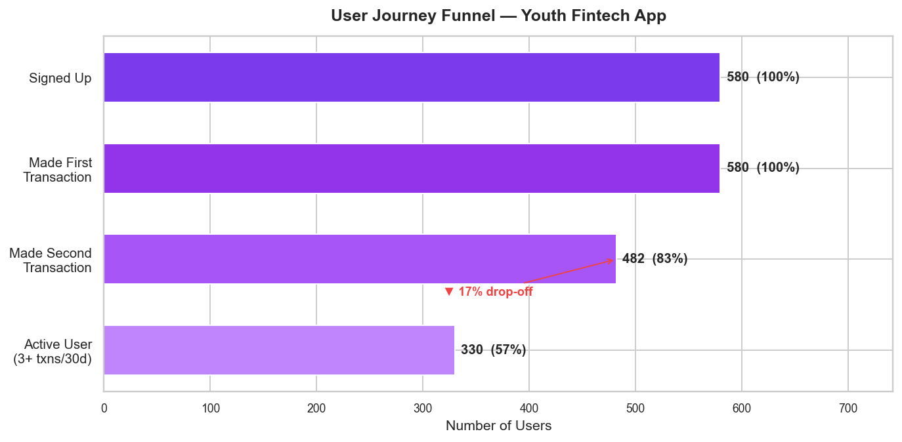
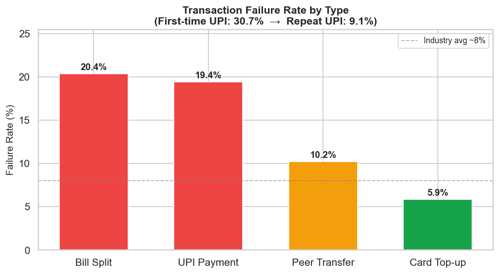
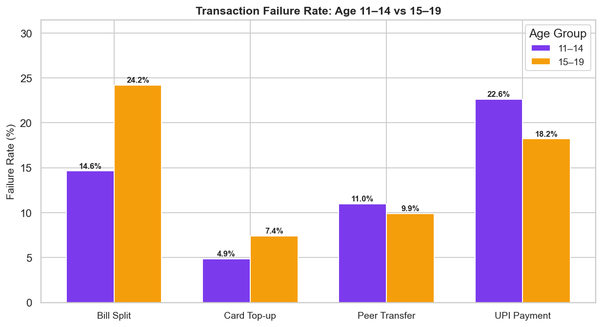
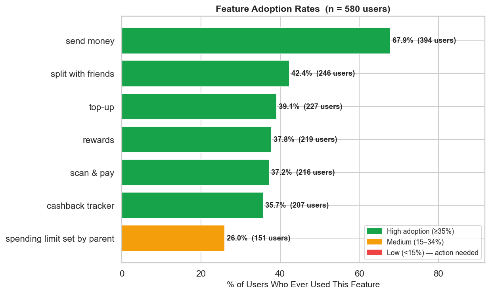
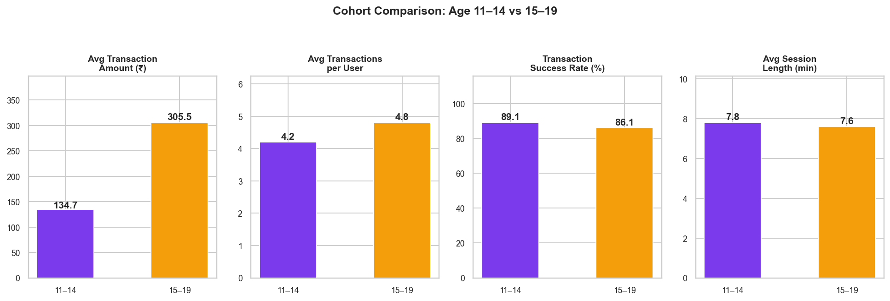
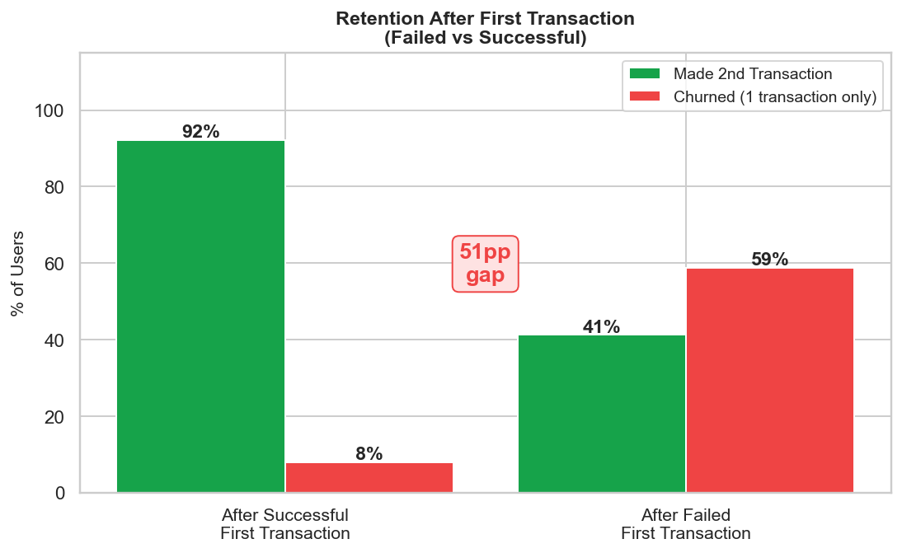

# fintech-user-funnel-analytics

> **Product analytics case study for a youth fintech app: quantitative funnel and drop-off
> analysis combined with user-pain-point synthesis and data-backed product recommendations**

[](https://python.org)
[](https://pandas.pydata.org)
[](https://matplotlib.org)
[](https://seaborn.pydata.org)
[](LICENSE)

---

## What This Is

An end-to-end product analytics case study modelled on a **youth-focused UPI and card payments app**
(think: apps like FamPay that serve users aged 11-19). The project demonstrates how a product
analyst works from raw transaction data to actionable recommendations — combining quantitative
funnel analysis with a structured qualitative synthesis exercise.

**Transparency note on user research:** The "user feedback" section in [`research/user_feedback.md`](research/user_feedback.md)
contains simulated pain-point quotes that I wrote as a self-designed case study exercise. They are
not from real interviews with an actual company's users. They are realistic and plausible — drawn
from first-principles knowledge of youth fintech UX challenges — and are explicitly cross-validated
against the quantitative patterns in this dataset to show how qualitative and quantitative signals
should inform each other. The goal is to demonstrate a product analyst's method, not to fabricate
primary research.

---

## Problem Framing

**Question:** Where does a youth payments app lose users, which transactions are most likely to
fail, and what product changes would move the needle on activation and retention?

**Analytical lens:**
- User journey funnel — where is the steepest drop-off?
- Transaction failure analysis — which types, which user segments?
- Feature adoption — what is underused or underperforming?
- Cohort comparison — do 11-14 and 15-19 year-olds behave differently?
- Post-failure churn — how much retention loss does a single failed transaction cause?

---

## Key Findings

| Finding | Number |
|---|---|
| Total users analysed | 580 |
| Total transactions | 2,637 |
| Users who made a second transaction | **83.1%** |
| Users who became active (3+ txns in 30d) | **56.9%** |
| **First-time UPI failure rate** | **30.7%** |
| Repeat UPI failure rate | 9.1% — 3.4× lower |
| Bill Split failure rate (highest of any type) | **20.4%** |
| Retention after successful first transaction | **92.1%** |
| Retention after failed first transaction | **41.2%** |
| **Churn gap caused by a single failed first tx** | **51 percentage points** |
| Avg transaction amount — age 11-14 | ₹134.7 |
| Avg transaction amount — age 15-19 | ₹305.5 (2.3× higher) |
| "spending limit set by parent" adoption | 26.0% (low for a core feature) |

**The single most important finding:** A failed first transaction causes a **51 percentage-point
drop in user retention**. This is not a minor friction — it is an activation cliff. Fixing the
first-time UPI success rate from 69% to even 85% would materially improve the number of users
who reach their second transaction.

---

## Dashboard

### Chart 1 — User Journey Funnel


**Reading it:** 580 users signed up. 83.1% made a second transaction. Only 56.9% became active users
(3+ transactions within a 30-day window). The gap between "made first transaction" and "active user"
is the primary area of product focus.

---

### Chart 2 — Transaction Failure Rate by Type


**Reading it:** UPI Payment (overall 19.4%) and Bill Split (20.4%) have the highest failure rates.
Card Top-up is the most reliable at 5.9%. The first-time UPI failure rate of 30.7% vs 9.1% for
repeat UPI shows that bank-linking friction — not UPI itself — is the root cause.

---

### Chart 3 — Failure Rate by Age Group


**Reading it:** UPI failure is elevated across both age groups, but the 11-14 cohort is
disproportionately hurt by Bill Split failures, likely because the group-expense UX was designed
with older teens in mind.

---

### Chart 4 — Feature Adoption Rates


**Reading it:** "send money" leads at 67.9%. "spending limit set by parent" trails at 26.0% — critical
for the product's parental safety positioning and clearly underdiscovered. Bill Split is used by
42.4% of users but fails them at the highest rate (20.4%) — a broken-promise dynamic.

---

### Chart 5 — Cohort Comparison: 11-14 vs 15-19


**Reading it:** Older teens (15-19) transact at 2.3× the value (₹305 vs ₹134) and slightly higher
frequency (4.8 vs 4.2 tx/user). Younger users have a marginally better success rate (89.1% vs 86.1%)
because they skew toward the more reliable Card Top-up flow. Both groups have nearly identical
session lengths (~7.7 min), suggesting engagement depth is similar — the difference is spend volume.

---

### Chart 6 — Retention After First Transaction: Success vs Failure


**Reading it:** 92.1% of users whose first transaction succeeded made at least one more transaction.
Only 41.2% of users whose first transaction failed returned. This 51pp gap is the largest single
lever the product team can pull.

---

## Simulated User Research Synthesis

> Full quotes and data mapping in [`research/user_feedback.md`](research/user_feedback.md)

Below are the most critical pain points from the user research synthesis exercise, linked to
their quantitative signal:

| Pain Point | User Quote (simulated) | Data Signal |
|---|---|---|
| First UPI failure with no error context | *"It said 'Payment failed' but didn't tell me what to do next."* | 30.7% first-UPI fail rate |
| Abandoned after first failure | *"I didn't try again for a few weeks. It just felt unreliable."* | 51pp retention gap |
| Spending limit not discoverable | *"I tried to pay ₹500 and it got declined. I didn't know it was the limit."* | 26% feature adoption |
| Bill Split fails in group settings | *"I couldn't figure out who gets charged what — I gave up."* | 20.4% bill split failure rate |
| Ambiguous processing state | *"It said 'processing,' then failed. But ₹100 was gone for two days."* | ~14-16% of first-UPI txns hit ambiguous state |

---

## Product Recommendations

Prioritised by estimated impact × feasibility:

---

### Recommendation 1 — Fix First-Time UPI Onboarding (Priority: Critical)

**What:** Add a pre-transaction bank account validation step. When a user tries their first UPI
payment without a verified bank link, show a 3-step guided "UPI Setup" flow (link bank → verify
₹1 test debit → confirm) before the payment proceeds. Add a clear root-cause error state:
"Your bank account isn't linked yet — here's how to fix it" instead of a generic "Payment failed."

**Data backing:** 30.7% first-time UPI failure rate vs 9.1% repeat. A guided flow that moves
even 15% of failures into successes would prevent ~25 users per 580 from hitting the churn cliff.

**User pain point:** *"I thought topping up was enough. When I tried UPI it kept asking me to
link a bank account. Why didn't it just tell me that?"* (Quote #7)

**Success metric:** First-time UPI success rate ≥ 85% within 90 days of launch.

---

### Recommendation 2 — Re-Engagement Nudge After Failed First Transaction (Priority: Critical)

**What:** Trigger a contextual in-app notification 24 hours after a failed first transaction:
"Your payment didn't go through last time — here's what happened and how to fix it in 1 step."
Include a one-tap retry pre-filled with the same payment details. For users who still haven't
transacted after 72 hours, send a push notification with a ₹5 cashback incentive on their next
successful payment.

**Data backing:** Only 41.2% of users who experienced a failed first transaction made a second
transaction — vs 92.1% for users who succeeded. At 580 users, there were 98 single-transaction
users. Converting even 30% of them would add ~29 active users per cohort.

**User pain point:** *"I was embarrassed because I was trying to pay my friend back. I just
started using my sister's PhonePe instead."* (Quote #2)

**Success metric:** 30-day retention rate for post-failure users lifts from 41% to ≥60%.

---

### Recommendation 3 — Reduce Bill Split Failure Rate + Improve Error UX (Priority: High)

**What:** Bill Split has 42.4% adoption (it's being found) but a 20.4% failure rate (it's
letting users down). Two fixes: (a) add a pre-check that all split recipients have the app
installed before initiating — if they don't, offer a fallback to a payment link; (b) show a
clear settlement preview screen ("You pay ₹150. Priya pays ₹75. Kiran pays ₹75.") before
confirming, reducing user confusion about who owes what.

**Data backing:** Bill Split failure rate (20.4%) is the highest of any transaction type,
nearly 3.5× the Card Top-up rate (5.9%). The feature is visible enough (42.4% adoption) —
the problem is conversion quality, not discovery.

**User pain point:** *"I tried to split with four friends. One didn't even have the app.
The feature felt unfinished — I ended up doing separate payments."* (Quote #4)

**Success metric:** Bill Split failure rate drops below 12% within 60 days of UX changes.

---

## Methodology

```
Synthetic data generation
    ↓
580 users · 2,637 transactions
11 realistic patterns baked in (age distributions, first-UPI failure spike,
post-failure churn, feature age-gating, etc.)
    ↓
Pandas analysis
    ├── Funnel: signup → first tx → repeat → active
    ├── Failure rates by type + age group
    ├── Feature adoption rates
    └── Cohort comparison (11-14 vs 15-19)
    ↓
6 matplotlib/seaborn dashboard charts
    ↓
Qualitative synthesis (10 simulated user quotes, explicitly labelled)
    ↓
3 prioritised product recommendations tied to data + pain points
```

---

## Project Structure

```
fintech-user-funnel-analytics/
├── src/
│   ├── generate_data.py       # Synthetic dataset generation (3 realistic patterns)
│   └── analysis.py            # Funnel metrics, charts, all key findings
├── data/
│   └── user_activity.csv      # 2,637 rows × 9 columns
├── dashboard/
│   ├── 01_user_journey_funnel.png
│   ├── 02_failure_rate_by_type.png
│   ├── 03_failure_rate_by_age.png
│   ├── 04_feature_adoption.png
│   ├── 05_cohort_comparison.png
│   └── 06_post_failure_churn.png
├── research/
│   └── user_feedback.md       # 10 simulated pain-point quotes + data mapping
├── requirements.txt
├── .gitignore
└── README.md
```

---

## Quick Start

```bash
git clone https://github.com/udayvimal/fintech-user-funnel-analytics
cd fintech-user-funnel-analytics
pip install -r requirements.txt

# Generate dataset
python src/generate_data.py

# Run analysis + generate dashboard charts
python src/analysis.py
```

---

## Dataset Schema

| Column | Type | Description |
|---|---|---|
| user_id | string | Unique user identifier (USR_0001 … USR_0580) |
| age | int | User age (11-19) |
| signup_date | date | Date user registered |
| transaction_date | date | Date of this transaction |
| transaction_type | string | UPI Payment / Card Top-up / Peer Transfer / Bill Split |
| amount_inr | float | Transaction amount in Indian Rupees |
| status | string | success / failed / declined |
| feature_used | string | App feature used during this session |
| app_session_length | float | Session duration in minutes |

**Synthetic patterns baked in:** First-time UPI failure 30.7%, post-failure churn 62%, Bill Split
highest failure rate, Card Top-up preferred by 11-14 cohort, "spending limit set by parent" age-gated,
older teens transact 2.3× higher amounts, session length spikes 20-60% after failed transactions.

---

*Part of the [udayvimal](https://github.com/udayvimal) data & AI portfolio — built for product
analyst and data analyst roles at consumer fintech companies.*
