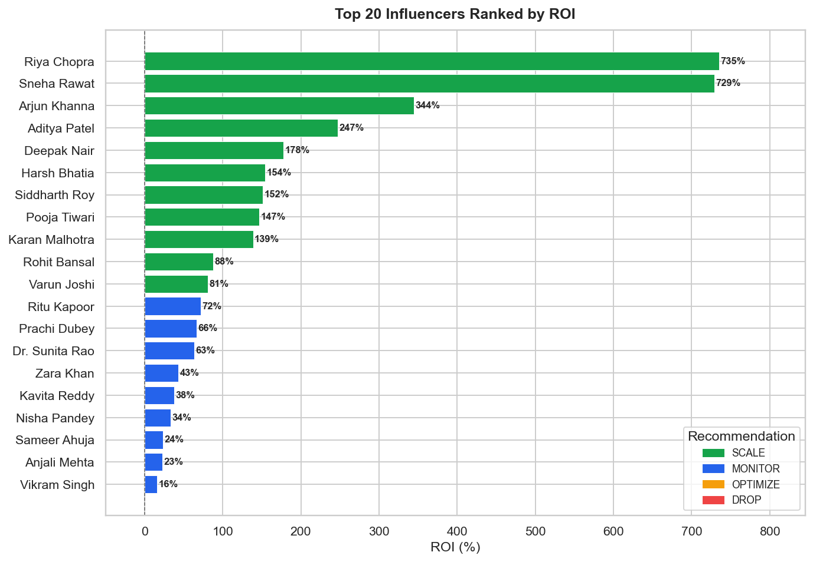
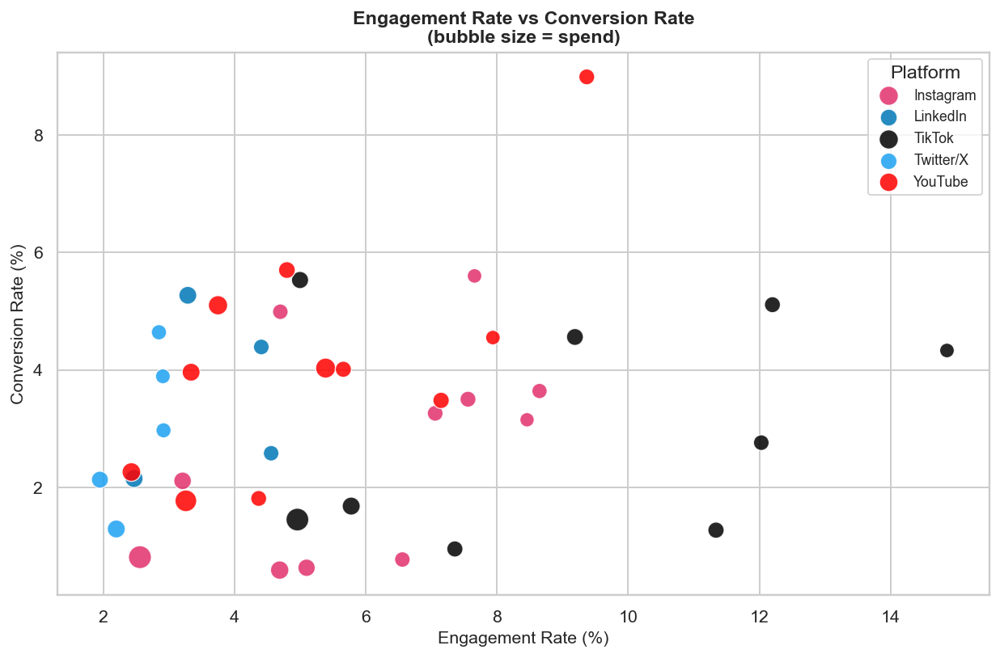
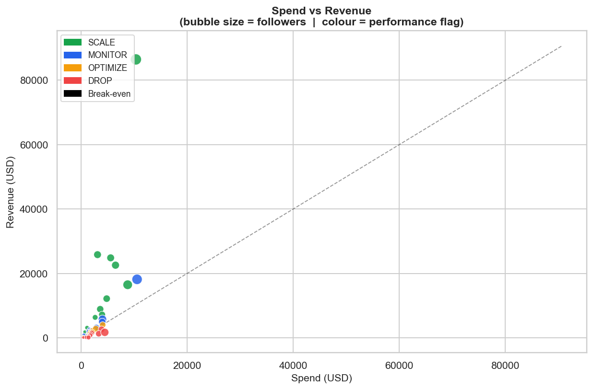
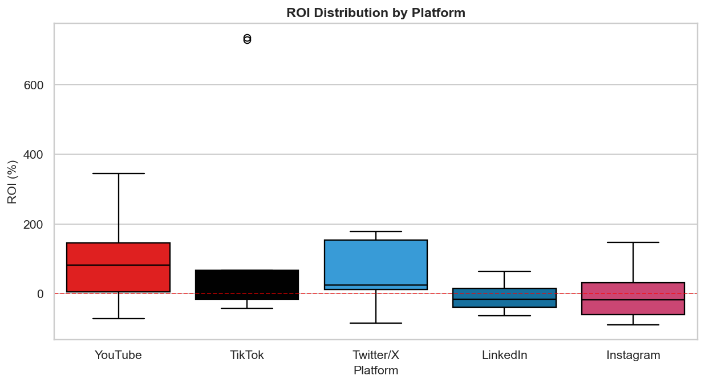
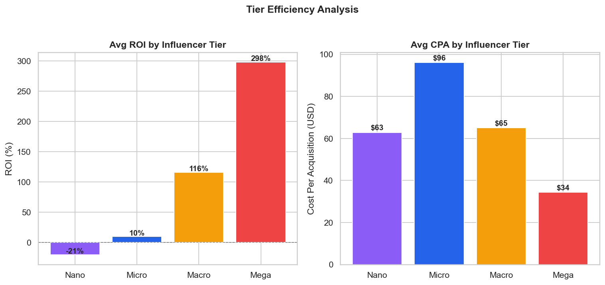
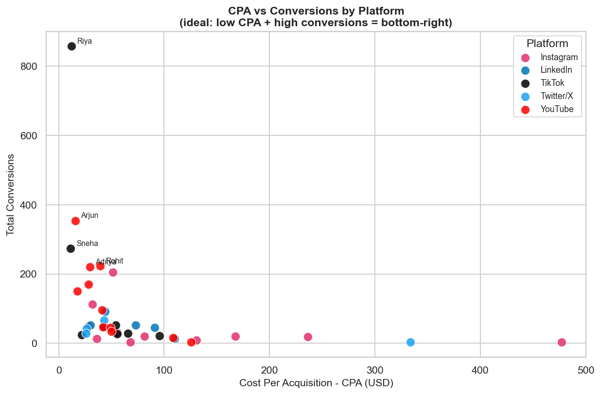

# Influencer Campaign Tracker

> **Influencer campaign performance tracker measuring reach, engagement, conversions, and ROI with AI-driven optimization recommendations**

[](https://python.org)
[](https://groq.com)
[](https://pandas.pydata.org)
[](https://matplotlib.org)
[](LICENSE)

---

## Overview

End-to-end influencer marketing analytics pipeline. Ingests campaign data for **40 influencers** across Instagram, YouTube, TikTok, Twitter/X, and LinkedIn, computes 10+ performance metrics, ranks creators with a four-tier performance flag, and routes the results through a **Groq Llama 3.3 70B** model to generate strategic optimization recommendations — all saved as structured CSVs and a Markdown report with six dashboard visualisations.

---

## Key Results

| Metric | Value |
|---|---|
| Influencers Analysed | 40 |
| Platforms Covered | 5 (Instagram, YouTube, TikTok, Twitter/X, LinkedIn) |
| Total Campaign Spend | $119,780 |
| Total Revenue Generated | $284,780 |
| Portfolio ROMI | **1.65x** |
| Portfolio ROI | **137.8%** |
| Avg CPA | $77 |
| SCALE-flagged Influencers | 11 (27.5%) |
| DROP-flagged Influencers | 12 (30%) |

---

## Performance Flags

| Flag | Threshold | Count | Action |
|---|---|---|---|
| **SCALE** | ROI ≥ 80% | 11 | Double down — increase budget |
| **MONITOR** | ROI 10–79% | 10 | Track weekly, optimise creatives |
| **OPTIMIZE** | ROI −20% to 9% | 7 | A/B test new formats |
| **DROP** | ROI < −20% | 12 | Cut or renegotiate terms |

---

## Dashboard

### Chart 1 — Top 20 Influencers by ROI


### Chart 2 — Engagement Rate vs Conversion Rate


### Chart 3 — Spend vs Revenue (break-even line)


### Chart 4 — ROI Distribution by Platform


### Chart 5 — Tier Efficiency (Avg ROI & CPA)


### Chart 6 — CPA vs Conversions


---

## Top Performers

| Rank | Influencer | Platform | Tier | ROI | ROMI | CPA | Conv |
|---|---|---|---|---|---|---|---|
| 1 | Riya Chopra | TikTok | Mega | 735% | 8.35x | $12 | 857 |
| 2 | Sneha Rawat | TikTok | Macro | 729% | 8.29x | $11 | 273 |
| 3 | Arjun Khanna | YouTube | Macro | 345% | 4.44x | $16 | 354 |
| 4 | Aditya Patel | YouTube | Macro | 247% | 3.47x | $30 | 220 |
| 5 | Deepak Nair | Twitter/X | Micro | 178% | 2.78x | $26 | 43 |

---

## AI Recommendations (Groq — Llama 3.3 70B)

> Real output generated from actual campaign metrics on 2026-06-25

**Overall Campaign Assessment:**
The campaign has shown impressive results, with top performers like Riya Chopra and Sneha Rawat achieving ROIs of 735% and 729%, respectively, on TikTok. However, the campaign also has room for optimisation, as evident from the bottom performers, particularly on Instagram and LinkedIn, where the average ROI is negative.

**Top 5 Influencers to SCALE:**
- **Riya Chopra** (TikTok, Mega): Achieved an impressive ROI of 735% with a high engagement rate of 5.0%.
- **Sneha Rawat** (TikTok, Macro): Demonstrated a strong ROI of 729% with a significant number of conversions (273).
- **Arjun Khanna** (YouTube, Macro): Showed a notable ROI of 344% with a decent engagement rate of 3.8%.
- **Aditya Patel** (YouTube, Macro): Achieved a respectable ROI of 247% with a high engagement rate of 5.4%.
- **Deepak Nair** (Twitter/X, Micro): Delivered a positive ROI of 178% despite being a micro-influencer.

**Top 5 to DROP or OPTIMIZE:**
- **Ankit Sharma** (Twitter/X): −85% ROI, CPA of $334 — worst cost efficiency in the portfolio.
- **Sanya Verma** (Instagram): −91% ROI, CPA $477 — no conversion traction, exit immediately.
- **Meera Iyer** (Instagram): −74% ROI despite 8.7% engagement — high engagement not translating to conversions.
- **Pradeep Kulkarni** (LinkedIn): −64% ROI — renegotiate LinkedIn B2B deliverables or replace creator.
- **Nikhil Gupta** (YouTube Nano): −72% ROI, only 4 conversions from $503 spend.

**Strategic Observations:**
- **TikTok is the clear platform winner** — average ROI of 169.1% and average engagement of 9.2%, highest across all platforms. Riya Chopra alone drove 857 conversions at $12 CPA.
- **YouTube Macro tier outperforms all tier/platform combinations** — Arjun Khanna (345%), Aditya Patel (247%), and Siddharth Roy (152%) all on YouTube Macro; this combination should receive the largest budget reallocation.
- **Instagram and LinkedIn underperformed** — average ROIs of −8.9% and −8.4% respectively, driven by low CTR-to-conversion ratios despite acceptable engagement; creative format and targeting need a full rethink on these platforms.

---

## Metrics Computed

| Metric | Formula |
|---|---|
| **ROI (%)** | `(Revenue − Spend) / Spend × 100` |
| **ROMI** | `Revenue / Spend` |
| **CPA** | `Spend / Conversions` |
| **CTR (%)** | `Clicks / Reach × 100` |
| **Conv Rate (%)** | `Conversions / Clicks × 100` |
| **CPM** | `Spend / Impressions × 1000` |
| **Revenue per 1K Reach** | `Revenue / Reach × 1000` |

---

## Project Structure

```
influencer-campaign-tracker/
├── data/
│   ├── influencers_raw.csv          # 40 influencer campaign records
│   ├── influencer_metrics.csv       # Computed metrics + flags + rankings
│   └── partnerships_records.csv     # Contract + deliverables log
├── dashboard/
│   ├── 01_roi_ranking.png
│   ├── 02_engagement_vs_conversion.png
│   ├── 03_spend_vs_revenue.png
│   ├── 04_roi_by_platform.png
│   ├── 05_tier_efficiency.png
│   └── 06_cpa_vs_conversions.png
├── src/
│   ├── llm_client.py                # Groq / OpenAI / mock wrapper
│   ├── generate_data.py             # Synthetic dataset generation
│   ├── 01_metrics_and_ranking.py    # Metrics computation + LLM recommendations
│   └── 02_dashboard.py             # 6 matplotlib/seaborn charts
├── recommendations.md               # Full LLM output report
├── .env.example
├── requirements.txt
└── README.md
```

---

## Quick Start

```bash
# 1. Clone and install
git clone https://github.com/udayvimal/influencer-campaign-tracker
cd influencer-campaign-tracker
pip install -r requirements.txt

# 2. Add Groq API key
cp .env.example .env
# edit .env → set GROQ_API_KEY=gsk_...

# 3. Generate data
python src/generate_data.py

# 4. Compute metrics + get AI recommendations
python src/01_metrics_and_ranking.py

# 5. Generate dashboard charts
python src/02_dashboard.py
```

---

## Dataset Design

- **40 influencers** across 5 platforms and 4 tiers (Nano / Micro / Macro / Mega)
- **Niches:** Beauty, Skincare, Fashion, Fitness, Food, Travel, Tech, Finance, Gaming, Education, B2B SaaS, Career, Comedy, Dance, Wellness, Lifestyle, Marketing, Parenting
- **Campaigns:** Summer Glow Launch, Festive Season Push, New Year New You, Monsoon Refresh, Brand Awareness Q1, Diwali Special
- **Revenue model:** D2C average order value ($38–$95) × conversions with tier-based scaling and stochastic noise — produces realistic SCALE/MONITOR/OPTIMIZE/DROP distribution

---

## Platform Benchmarks (from this campaign)

| Platform | Avg ROI | Avg Engagement | Avg CPA |
|---|---|---|---|
| TikTok | +169% | 9.2% | $46 |
| YouTube | +183% | 5.6% | $55 |
| Twitter/X | +155% | 2.7% | $102 |
| Instagram | −9% | 5.7% | $122 |
| LinkedIn | −5% | 4.0% | $87 |

---

## Tech Stack

| Layer | Technology |
|---|---|
| Data generation | Python / NumPy / CSV |
| Metrics computation | pandas 2.0+ |
| LLM recommendations | Groq API — Llama 3.3 70B Versatile |
| Visualisation | Matplotlib 3.7 + Seaborn |
| Config | python-dotenv |
| Fallback | Mock mode (runs without API key) |

---

*Part of the [udayvimal](https://github.com/udayvimal) data & AI portfolio — built for marketing analytics and AI analyst roles.*
