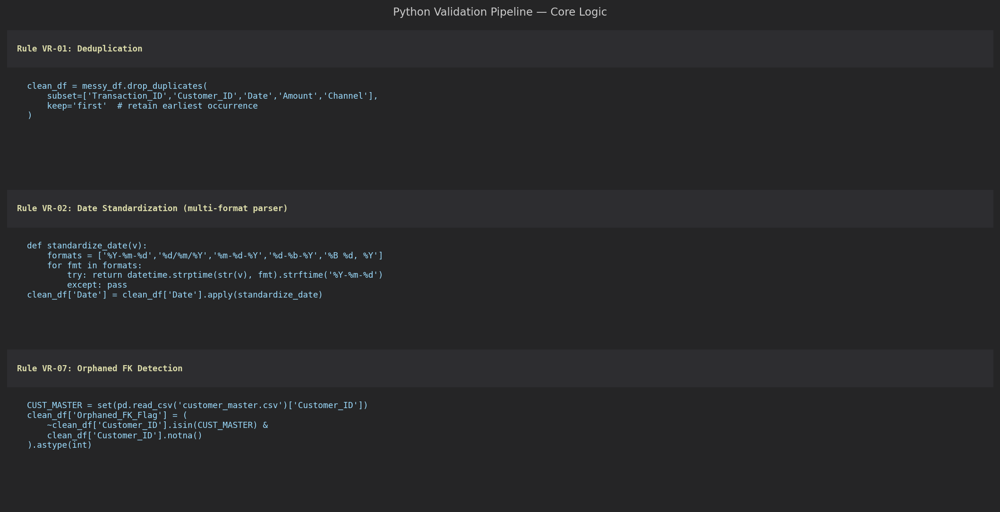

# Reporting Data Quality & Validation Pipeline

> Built to demonstrate continuous data quality improvement — a companion project to the AML Transaction Monitoring MIS Report for the **American Express MIS Apprentice** role. Generates a 10,000-row messy MIS source dataset with 7 classes of seeded issues, runs a Python validation pipeline that profiles, cleans, and re-profiles the data, and produces an Excel before/after scorecard with conditional formatting and a full audit log.

---

## Key Results

| Metric | Before | After | Change |
|---|---|---|---|
| **Total rows** | **10,000** | **9,660** | **-340 duplicates removed** |
| **Duplicate records** | **340 (3.4%)** | **0 (0%)** | Resolved |
| **Missing Amount** | **450 (4.5%)** | **450 (4.7%)** | Flagged |
| **Missing Customer ID** | **200 (2.0%)** | **200 (2.1%)** | Flagged |
| **Non-standard date formats** | **500 (5.0%)** | **0 (0%)** | Resolved |
| **Negative amounts** | **50 (0.5%)** | **50 (0.5%)** | Flagged |
| **Channel label variants** | **400 (4.0%)** | **0 (0%)** | Resolved |
| **Orphaned foreign keys** | **80 (0.8%)** | **80 (0.8%)** | Flagged |
| **Overall DQ Score** | **79.8%** | **91.9%** | **+12.1 percentage points** |

---

## DQ Scorecard — Before vs After


Left: grouped bar chart comparing before (red) and after (green) count for each issue type. Right: DQ score circles — 79.8% before (red) → 91.9% after (green), +12.1pp improvement. Three issue types fully resolved (duplicates, date formats, channel variants); four types flagged for human review (missing values, negatives, orphaned FKs).

---

## Issue Breakdown & Resolution Method


Left: horizontal bar showing volume by issue type before cleaning. Right: pie chart of resolution method — **Resolved/Removed** (duplicates eliminated), **Standardized/Transformed** (dates and channel labels normalized), **Flagged/Retained** (missing values, negatives, orphaned FKs retained with flag columns for investigation).

---

## Pipeline Logic



Three core validation rules shown in the pipeline code view:

```python
# VR-01: Deduplication — remove exact duplicates, keep first occurrence
clean_df = messy_df.drop_duplicates(
    subset=["Transaction_ID","Customer_ID","Date","Amount","Channel"],
    keep="first"
)

# VR-02: Date standardization — multi-format parser
def standardize_date(v):
    formats = ["%Y-%m-%d", "%d/%m/%Y", "%m-%d-%Y", "%d-%b-%Y", "%B %d, %Y"]
    for fmt in formats:
        try: return datetime.strptime(str(v), fmt).strftime("%Y-%m-%d")
        except: pass

# VR-07: Orphaned FK detection — flag customers not in master
clean_df["Orphaned_FK_Flag"] = (
    ~clean_df["Customer_ID"].isin(CUST_MASTER) &
    clean_df["Customer_ID"].notna()
).astype(int)
```

---

## Issues Seeded in Raw Dataset

| Issue Type | Count | Seeding Method |
|---|---|---|
| Duplicate records | 340 | Rows 0–339 appended verbatim to end of dataset |
| Missing Amount | 450 | `df.loc[idx, "Amount"] = np.nan` on rows 340–789 |
| Missing Customer ID | 200 | `df.loc[idx, "Customer_ID"] = np.nan` on rows 790–989 |
| Non-standard dates | 500 | Converted to DD/MM/YYYY, MM-DD-YYYY, DD-Mon-YYYY, "Month DD, YYYY" |
| Negative amounts | 50 | `Amount = -abs(Amount)` on rows 1490–1539 |
| Channel label variants | 400 | "UPI" → "upi", "U.P.I.", "Upi", "UPI ", " UPI" etc. |
| Orphaned foreign keys | 80 | Customer_ID replaced with CUST_ORPH_001–080 (not in master) |

All issues are shuffled randomly into the dataset before saving — they do not appear in sequence.

---

## Validation Rules

| Rule ID | Field | Logic | Action |
|---|---|---|---|
| VR-01 | 5-field composite key | Duplicate across all 5 key fields | DROP — keep first occurrence |
| VR-02 | Date | Non-ISO format detected | TRANSFORM — parse and rewrite as YYYY-MM-DD |
| VR-03 | Channel | Non-canonical label (case/punctuation variant) | TRANSFORM — map to canonical: UPI/NEFT/IMPS/Card/Cash/Net Banking |
| VR-04 | Amount | NULL/blank | FLAG — add `Missing_Amount_Flag=1`; retain for reconciliation |
| VR-05 | Customer_ID | NULL/blank | FLAG — add `Missing_CID_Flag=1`; retain for attribution |
| VR-06 | Amount | `Amount < 0` | FLAG — add `Negative_Amount_Flag=1`; may be valid reversal |
| VR-07 | Customer_ID | Not in customer master | FLAG — add `Orphaned_FK_Flag=1`; requires onboarding verification |

---

## Excel Workbook

`excel/dq_validation_report.xlsx` — 3 sheets:

| Sheet | Content |
|---|---|
| `DQ_Summary` | Before/after scorecard with conditional formatting (red→green improvement) |
| `Audit_Log` | Per-rule audit log: rule name, before count, after count, records affected, note |
| `Validation_Rules` | Full rule definitions: field, logic, action, priority |

**Conditional formatting rules on DQ_Summary:**
- Before Count > 0 → red fill
- After Count = 0 → green fill (resolved)
- After Count > 0 → yellow fill (flagged)
- Status = "Resolved" → green bold
- Status = "Flagged" → yellow bold

---

## Output Files

| File | Description |
|---|---|
| `data/raw_mis_source_data.csv` | 10,000-row messy dataset with all issues seeded |
| `data/cleaned_mis_data.csv` | 9,660-row cleaned dataset with 4 flag columns appended |
| `data/audit_log.csv` | 7-row audit log — one record per validation rule applied |
| `excel/dq_validation_report.xlsx` | 3-sheet Excel before/after report with CF |
| `images/01-dq-scorecard-comparison.png` | Before/after bar + DQ score circles |
| `images/02-issue-breakdown.png` | Issue volume + resolution method |
| `images/03-pipeline-code-view.png` | Core pipeline logic (dark code view) |

---

## File Structure

```
reporting-data-quality-validation-pipeline/
├── scripts/
│   └── build_all.py              # Full pipeline: generate → seed → validate → report
├── data/
│   ├── raw_mis_source_data.csv   (10,000 rows — messy, seeded with 7 issue types)
│   ├── cleaned_mis_data.csv      (9,660 rows — cleaned + 4 flag columns)
│   └── audit_log.csv             (7 rows — one per validation rule)
├── excel/
│   └── dq_validation_report.xlsx (3 sheets — DQ summary, audit log, rule definitions)
├── images/
│   ├── 01-dq-scorecard-comparison.png
│   ├── 02-issue-breakdown.png
│   └── 03-pipeline-code-view.png
└── README.md
```

## Quick Start

```bash
pip install pandas numpy openpyxl matplotlib
python scripts/build_all.py
# Generates raw CSV, runs pipeline, saves cleaned CSV + audit log, builds Excel + images
```

---

## Design Philosophy

Issues fall into three resolution categories:

1. **Remove** — Exact duplicates have zero informational value. Removing them is safe and unambiguous (340 records eliminated).
2. **Transform** — Inconsistent formatting is deterministic to fix. Dates and channel labels carry no ambiguity once standardized (500 + 400 records corrected).
3. **Flag** — Missing values, negatives, and orphaned FKs require **human judgement**: a missing Amount might be a system fault or a cash transaction not yet posted; a negative amount might be a refund. These are retained in the cleaned dataset with binary flag columns, and escalated for source-system reconciliation rather than silently dropped.

This three-tier approach (Remove / Transform / Flag) is the standard framework for production MIS data pipelines and avoids the trap of silently discarding records that may have business value.

---

*Portfolio project demonstrating continuous data quality improvement — deliberate issue seeding, rule-based validation pipeline, before/after profiling with quantified improvement, and Excel reporting with conditional formatting — directly aligned with American Express MIS Apprentice role requirements.*
